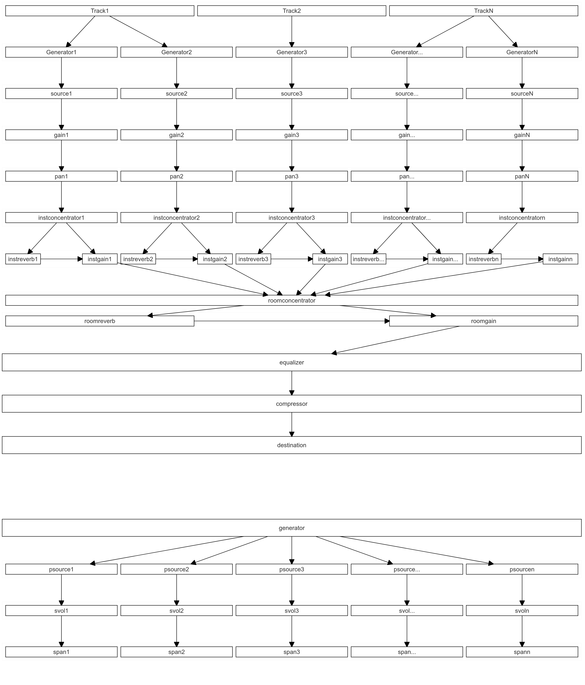
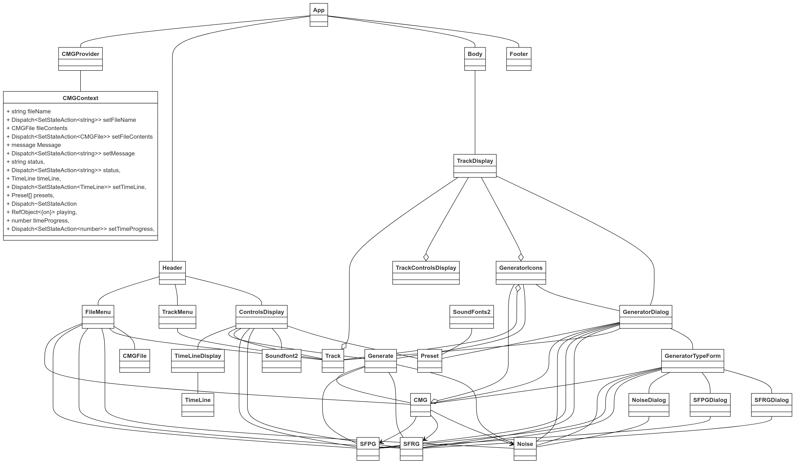

# Rambling

I want a music generator that will play one or more voices using various note generators. The generators may be sequnces random walk, or stocastic up to 3 degrees. Each voice can be assigned to a sound font file bank and preset.
Voice controls include

- start and stop times (may be multiple)
- soundfont bank and preset
- generation algorithm for note midi number (sine, triangular, square, randon walk, stocastic, e.g)
- generation algorithm for note modulation around the midi number
- generation algorithm for note start time
- generation algorithm for note duration
- envelop controls (velociy, attack, decay, sustain, hold, release, volume) these may be changed over time
  Files
- piece generation parameters (like JSON)
- generated sequence (XML)
- sound export (mp3, wav, etc.)

# Modes

Sound generation can be either previewed thru the computer speakers or recorded to a wave file. 

# Sound Generators
All sound generators have a time when its effect starts and stops. A generator maybe be muted.
There are three type of sound generators in this version.
1. A Soundfont Programmed Generator (SFPG). This generator creates repetitive sequences of notes using sine, sawtooth, square, or triangular wave forms. Pan and volume have the same repetitive generator. Each waveform have a center, frequency, amplitude, and phase. The waveforms are sampled at 10 times a second and a audio source is generated that starts at that time and ends 0.1 seconds later to be followed by another audio source until the stop time for the generator is reached.
Starting notes are taken from the Soundfont file preset.

2. A Soundfont Random Generator (SFRG). This generator creates markovian sequences of notes, volumes, and panning at a speed that is also a markovian sequence. This is a 4-dimensional markovian process where each dimension has three states with probability transitions between each state. The states are  
* keep the same value 
* move the value up 
* move the value down 

  Each sequence is bounded by a lower and upper limit and each move is done with a given step size. The speed dimension controls the time at which each transition in teh other dimensions occur. When an attribute hits an upper or lower limit, the value is reversed. For example, if pan is to move right and the suggest value is to move futher right, the value is changed to move down. Thus, the containment walls are not 'sticky'. The number of sources in a SPRG depends on the length of the generator time and the time frame of each random interval. 

  Starting notes are taken from the Soundfont file preset. 

3. A Noise Generator (Noise). This generator will create white or gausian from the start to stop time. It is broken up into 0.1 second duration sources for this interval to provide for volume and pan changes to occur during this period. Gaussian noise have a center frequency (Hz) and standard deviation that is applied to the amplitude of the noise. Volume and pan values have center, amplitude, frequency, and phase values and have the same repetitive types as SFPG

# Tracks

Generators are grouped together in tracks. A track may have zero or more generators assigned to it. The generators in a track may be of any type. Tracks may be muted or played solo. All tracks that are to be played solo are played together. Muting takes precendence over solo. 

# Web Audio Routing Graph

A Web Audio graph is constructed when a user selects preview or play. In either case, the graph is the same, only the audio context destination is changed. The graph is constructed using the muting and solo attributes of the tracks and the muting attributes of the generators. A single generator may be previewed.
The following figure illustrates the audio graph using an example where their are an abitrary number of tracks containing an arbitrary number of generators.

The upper figure focuses on overall structure from the generators to the compressor. The lower figure focuses on the multiple sources of a single generator.



The lower figure illistrates a generator that creates several sources, applies volume and pan to each source.

The upper figure presents those sources, volumes, and pans as a single box. Each generator group is connected to an 'instrument' concentrator to form a single node. This allows its buffer to be used by the instrument reverb node to send the reverb generted buffer it to the instrument gain convolver effect. If there is no instrument reverb, the gain effect is a simple gain mode of value 1.

The instrument gain nodes are routed to the room concentrator (a unit gain node). This in turn is routed the room and optionally to room reverberation. Like the instrument reverberator, the room reverberator uses use the concentrator output to generator the rever effect and pass the buffer to the room gain convolver.

The room gain output is routed to an equalizer, then to a compressor, and to the final destination (either computer speakers or a output stream).

# Application structure

The CMG application provides several features:
1. User definition of the all of the attributes of gloabl generation environment, include Soundfont file selection, room reverb, equalizer, and compressor. A library of Soundfont files is provided for selection.
2. Display of a timeline that can be panned and zoomed and shows the progress during preview
3. User creation, deletion, and maintenace of tracks including track renaming, solo, and mute
4. User creation, deletion, and maintenance of generators, including all attributes of each generator
5. Preview and Record functions. During either preview, only the characteristics of the room reverb, equalizer, and compressor may be changed. 
6. The ability save and load a defined computer music generation scenario

The figure below illustrates the class structure of teh application. It is implemented as a Vite client using Typetype. There is no web server involved.



The application is designed around the user interface and supported by a context provide. The three parts of the application are the header, body, and footer.

## Class Structure
Classes are used to define objects that are presisted in files while the user interface and sound generation are implemented through React functions. The general structure of the classes are
1. A set of attributes that define the objects of the class.
2. A constructor that requires a parameter to name the object. Other optional parameters may be present.
3. In the cases of object that are instantiated for sound genration purposes, a setContext function is used to create the objects that require an audio context and make internal node connections.
4. A copy function that makes a copy of the current object. This is used to cause React to trigger hooks when one or more of the properties of the object changes.
5. A setAttribute function that is called by the object maintenance functions of the user interface.
6. An appendXML function that added the objects definition to an XML document to be written to external storage. 
7. A getXML function that reads the object from a XML string
8. Specialized functions that handle manipulation of the object. This is primarily for objects that are used to build the audio graph and executed there.

## Header

The header is laid out in a grid containing a menu and a controls display. 

The menu has options for starting a new file, opening an exising file, save a file and creating a new track. 

The controls display provide for selection of a Soundfont file, manages the time line display pan and zoom, and provides for control of the execution of preview and record.

## Body

The body as a scollable area that holds all of the defined tracks. Each track has a control area and a display area. Track controls include delete, rename, solo, mute, move up and down the track list, and add genrator buttons. Track display include 'icons' for each generator defined on the track, which are displayed if their start and stop times overlap the current time line displayed.

When a generator is created, it has a default type of CMG, which contains the start time, stop time, instrument reverb attributes. The type may be changed to SFPG, SFRG, or Noise as desired. If left as CMG, it is a place holder that will not generate any sound.

The generator icons are display as rectangles that start and stop at the generator's times and are 1/3 of the height of the track display. This allows for movement on the icon vertically within the track display to reduce overlap. 

These icons have a menu that provides for generator editing, mute, and preview functions. Generators can be deleted through the edit function.

## Footer

The footer includes areas for a status message, room reverb, equalizer, and compressor attributes. 

## Preview and Record Generation

This is the business end of this application and most of the user interaction function is disabled when in either of these modes. The only interaction allowed is to stop the preview or record, or adjust the reverb (except reverb time and predelay), equalizer, and compressor parameters while previewing. 

Generation has the process:

1. Determine which generators will be used to build the audio routing graph, taking into account all tracks and generator mute and solo atributes. If a generator is running in preview mode, only it is selected.
2. If recording, request the user of the file name and location for the generated .wav file
3. Set the audio context based on the preview or record. If in preview, suspend the destination until all is ready to go.
3. Create the room concentrator for this context.
4. Set the context for the room gain, room reverb, equalizer, and compressor, and make the necessary connections from this concentrator to the destination.
4. Build all of the sources for all of the selected generators. For each genertor this includes:

    1. Setting the context for the generator object.
    2. Create an instrument concentrator for this context
    2. Looping through the various 'chunks' of the generator over time

        1. Get the current values for the generator
        1. Create the source for the chunk for that time
        2. Apply the volume and pan values for that time
        3. Connect the source, volume, pan together and connect the pan to the instrument concentrator
    2. Connect the instrument reverb and instrument gain nodes as appropriate. Have the reverb tail start at the start time of the source and stop at the start time + 4 times the release. 
    2. Connect the instrument gain to the room concentrator.

4. At this point all connections have been made. The 'tails' of the reverbs will have to the executed as time advances on the context. 
5. When in preview mode, the audio graph will run in realtime. The context is resumed. If room reverb is enabled, its 'tail' is started. 
5. A scheduler is used to determine which sources to process as time advances. There are two times involved in this. A lookahead time interval is used trigger the scheduler. It is set to run every 25 milliseconds. A Schedule ahead time is used to find which sources are about to start. This process continues until the user stops it or the entire piece has been scheduled. For each source that is about to start, set the start and stop times, applying a fader to the last source in the generator group.
6. When in record mode, just start the rendering process and when finished, write the buffer to a wav file. 

# The CMG file structure

A generate configuration is defined by an XML file that has the following structure, for example

```xml
<fileContents name="gen7.cmg" SFFileName="">
    <compressor name="roomcompressor" attack="0.003" knee="30" ratio="12" release="0.25" threshold="-24"/>
    <equalizer gain0="0" gain1="0" gain2="0" gain3="0" gain4="0" gain5="0" gain6="0" gain7="0" gain8="0" gain9="0"/>
    <roomreverb name="roomreverb" enabled="false" attack="0.1" decay="0.1" predelay="0.03" release="1" reverbtime="1"/>
    <tracks>
        <track name="T1" mute="false" solo="false">
            <generators>
                <generator name="G1" type="CMG" startTime="0" stopTime="3" solo="false" mute="false" position="0"/>
                <generator name="G2" type="CMG" startTime="10" stopTime="20" solo="false" mute="false" position="0"/>
            </generators>
        </track>
        <track name="T2" mute="false" solo="false">
            <generators>
                <generator name="G1" type="CMG" startTime="10" stopTime="20" solo="false" mute="false" position="0"/>
            </generators>
        </track>
    </tracks>
</fileContents>
```

# Thanx
Special thanx to various people

- My son, Ryan Lane, that got me into web-based programming
- [sfumato](https://github.com/felixroos/sfumato) - who revealed the complexities of soundfont signal processing
- WebAudio documentation, particulary the authors of the page [Advanced techniques: Creating and sequencing audio](https://developer.mozilla.org/en-US/docs/Web/API/Web_Audio_API/Advanced_techniques)
- Russell Good for his blog [How to Convert an AudioBuffer to an Audio File with JavaScript](https://russellgood.com/how-to-convert-audiobuffer-to-audio-file/)
- Mathew Willox for his blog [Making Reverb with the Web Audio API](https://blog.gskinner.com/archives/2019/02/reverb-web-audio-api.html)
- Duckduckgo search engine that helped me hack my way through this

# Versions - Changes

## Remaining things to do

- set a playback interval on the timeline. all generators that fall completing within the interval will be previewed or recorded.
- create echo effect
- add a fade out of about 1 second at the end of the piece.

## Done this release
- restucture the code based on the design description above. 
- create instrument and reverb effects - not yet tested

## Previously done

- add progress on timeline rather than a popup (sort of works)
- do a decay at the end of a generator to stop the 'clicking' (didn't work but does softening end transition)
- save and load file need cmg type
- when the soundfont file is changed, map the existing presets to the same bank and 'preset'
- do a soft release at the end of the each generator so it doesn't abroptly
- AHHH! whote noise is buggered up
- disable record prevew and generator text when sounds are playing (the screen should be locked while previewing or recording)
- make timeline scroll
- see Onev2 T2, G1 for range problem with midi sine wave (non repeatible)
- refactored tracksdisplay separating trackcontrolsdisplay
- record to wav offline (maybe changed to mpg format)
- can only rename a track once. gets hung up with previous track rename.
- clear message and status areas on at each interaction
- try to prevent track updates during rendering (failed)
- add a repeat option to soundfont samples - some presets have bad repeat patterns. Could repeat from beginning as a option (loop repeat, beginning repeat, no repeat)
- implement keyboard short cuts (browser is very pushy) only ctrl+o and ctrl+s implemented
- implement a equalizer
- generator icons are not displaying when the start time preceded
- implement modals for all popovers
- implement a compressor
- added generator not displayed until timeline is changed, when file is opened, when track is renamed. looks like a trackref timing issue
- attempted an 'instrument' reverb, but it was forcing too many connects and disconnects
- setup formal testing sequence

