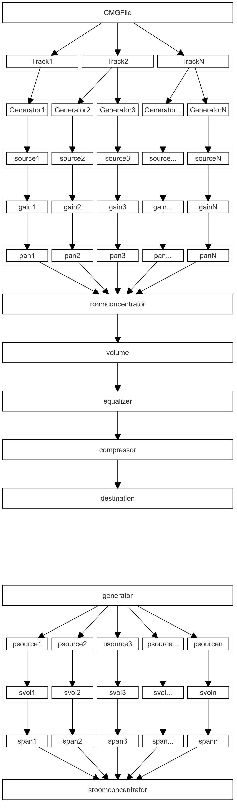
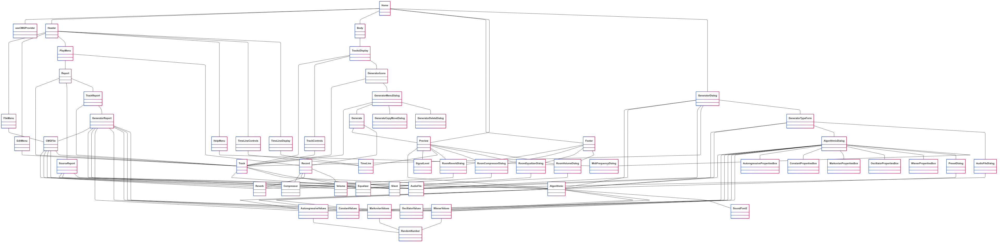

# Rambling

This work is inspired by the book [Formalized Music: Thought and Mathematics in Composition](https://en.wikipedia.org/wiki/Formalized_Music). Though the principles in that book are only partially realized here, more work may be done...

The music generator will play one or more voices using various algorithms or from an existing audio file. The algorithms may be an oscillator, Markovian state transitions, or Wiener random walks. Noise may be applied to each voice Each voice can be assigned to a sound font file bank and preset. Audio files may be of any type that can be loaded by the browser being used.
Algorithmic voice controls include

- start and stop times
- soundfont bank and preset
- generation algorithms for a voice's note, speed, volume, and pan (oscillator, Markovian, or Wiener)
- application of gaussian noise to a voice
- optional reverberation for each generator
- rhythm selection based on a Euclidean Rhythm algorithm
- the number of notes used in an octave based on the Euclidean Rhythm algorithm. 
- gain envelop controls (delay, attack, hold (sustain), decay, release) these may be changed over time that come from the soundfont preset
- Sound generation can be either previewed thru the computer speakers or recorded to a wave or mp3 file.  

Room effects and controls are implemented. They include volume, reverb (both early reflections and diffuse noise), compression, and equalization.

# Sound Generators
All sound generators have a time when its effect starts and stops. A generator maybe be muted. 
There are two types of sound generators in this version.
1. An algorithmic generator, which uses selectable algorithms for the assigned voice's parameter. Each of the voice's parameters may be assigned a different algorithm. The algorithm assigned to the note parameter uses midi numbers to select presets from a soundfont file. 
    * The oscillator algorithm creates a sequence of values using sine, sawtooth, square, or triangular wave forms. Each waveform have a center, frequency, amplitude, and phase. The waveforms are sampled at each beat and a audio source is generated that starts at that time and ends at the next beat. If the amplitude is zero, the value generated is the center value.
    * The Markovian algorithm creates a sequence of values for the assigned voice's parameter. This is a statistical Markov process that has three states with probability transitions between each state. The states are  
        * keep the same value 
        * move the value up 
        * move the value down 
    If the state transition are such that all transition from the same state to the same state are 1, the value generated is always the starting value.
    Each sequence is bounded by a lower and upper limit and each move is done with a given step size. When an attribute hits an upper or lower limit, the value is reversed. For example, if pan is already at its upper limit and the suggested value is to move further up, the value is changed to move down. Thus, the containment walls are not 'sticky'.
 
    * The Wiener algorithm creates a sequence values for the assigned voice's parameter. THis is a statistical Wiener process that has an assigned trend and dispersion. If the dispersion if 0, the initial value is always used.
    * A Euclidean Rhythm algorithm is used to determine a beat pattern and the notes selectable with in octave. 
        * The number of beats in the measure is specified along with the number of 'on beats'. An 'on beat' is one that will produce a sound from the current preset, while an 'off beat' is silent no matter what preset is currently active. If the measure length and on beat count are the same, all notes will be played.
        * The number of notes in an octave determines which presets are available for use by the note parameter. When the note algorithm midi value, the value is modified to the closets selectable midi number. If the number of notes in the octave is set to 12, all notes in teh octave will be heard.
    * A Gaussian noise algorithm is used to apply noise the note's sample. The noise level determines the size of the noise signal, where 1 is the size of the original signal. The dispersion of the noise is given in midi numbers. If the dispersion if 0, no noise is applied.

2. An Audio File Generator (**AudioFile**). This generator contains the samples from an existing audio file, as long as the web browser audio conversion exists for the audio file type. The start time is controllable, but the stop time is set based on the duration of the audio file. Only the volume can be adjusted as it is assumed that panning is handled in the file itself. 

# CMG Data Structure

The data structure is hierarchial:

*  Called *CMGFile*, this includes all attributes that apply to all other attributes. It includes a filename, the room compressor, the room equalizer, the name of the soundfont file and its contexts, and a collection of tracks that contain generators.
* Called *TimeLine*, this includes attributes that define the left most time to be displayed, and the current zoom level. This data element is independent of CMGFile. i.e., time line setting persist between files and are not saved.
* Called *Track*, this is an instance of the track collection belonging to a CMGFile. Each track has name, solo, and mute attributes and a collection of generators. This provides the means by which generators can be assigned to different tracks for organizational purposes.
* Called *Generator*, this is an instance of a generator collection and is the source of the sound that is produced by CMG. There are currently three types of generators.

    * **CMG** - this generator is the parent of sound generators and does not generate sound. It contains the attributes that are common to all generators. This includes a name, start and end times, mute flag, and a vertical position with the track's timeline. 
    * The two types of generators that produce sound are listed above.

# Web Audio Routing Graph

A Web Audio graph is virtualized when a user selects preview or play. The connections are not made until the context time comes that it will need to be played. In either case, the graph is the same, only the audio context destination is changed. The graph is constructed using time line interval selector, the muting and solo attributes of the tracks, and the muting attributes of the generators. A single generator may be previewed.
The following figure illustrates the audio graph using an example where their are an arbitrary number of tracks containing an arbitrary number of generators.

The upper figure focuses on overall structure from the generators to the compressor. The lower figure focuses on the multiple sources of a single generator. A generator can create one or more sources depending on its type and the specified interval or speed.

The upper figure presents those sources, volumes, pans, and reverbs or a generator as a single box. Each generator group is connected to the room concentrator which has a gain of 1. The lower figure illustrates a generator that creates several sources, applies volume and pan to each source.

The room concentrator gain output is routed to an volume, equalizer, and compressor, and to the final destination (either computer speakers or a output stream).

# Application structure

The CMG application provides several features:
1. User definition of the all of the attributes of global generation environment, including room volume, equalizer, and compressor. 
2. Display of a timeline that can be panned and zoomed, and shows the progress during preview. A interval can be defined that will select generators to be recorded or previewed. 
3. User creation, deletion, and maintenance of tracks including track renaming, solo, and mute
4. User creation, deletion, and maintenance of generators, including all attributes of each generator.
5. Preview and Record functions. During either preview, only the characteristics of the room volume, reverb, equalizer, and compressor may be changed. 
6. The ability save and load a defined computer music generation scenario.

The figure below illustrates the class structure of the application. It is implemented as a Vite client using TypeScript. A webserver is used to access a library of soundfont files.

The application is designed around the user interface and supported by a context provided. The three parts of the application are the header, body, and footer. 

## Component Structure
Classes are used to define sound generator objects (CMG, Algorithmic, AudioFile) that are persisted in files while the user interface and sound generation are implemented through React functions. The general structure of the classes are
1. A set of attributes that define the objects of the class.
2. A *constructor* that requires a parameter to name the object. Other optional parameters may be present.
4. A *copy* function that makes a copy of the current object. This is used to cause React to trigger hooks when one or more of the properties of the object changes.
5. A *setAttribute* function that is called by the object maintenance functions of the user interface.
6. An *appendXML* function that added the objects definition to an XML document to be written to external storage. 
7. A *getXML* static function that reads the object from a XML string
The Algorithmic class links to AlgorithmValue objects for each of the voice parameters. The AlgorithmValue object may be AlgorithmicValues, OscillatorValues, MarkovianValues, or WienerValues. It also implements generator reverb.

Other function may be available for special needs. 

## Header

The header conyains the app icon, a set of puddown menus, the app title and version, and the name and state of the current file being edited at the top and the timeline controls and display below.

There are File, Edit, Generate, and Help pulldown menus.
The timeline controls manage the time line display pan and zoom, time line interval.

## Body

The body as a scrollable area that holds all of the defined tracks. Each track has a control area and a display area. Track controls include delete, rename, solo, mute, move up and down the track list, and add generator buttons. Track display include 'icons' for each generator defined on the track.

When a generator is created, it has a default type of CMG, which contains the start time and stop time attributes. The type may be changed to Algorithmic or AudioFile as desired. If left as CMG, it is a place holder that will not generate any sound.

The generator icons are displayed as rectangles that start and stop at the generator's times and are 1/3 of the height of the track display. This allows for movement on the icon vertically within the track display to reduce overlap. 

These icons have a menu that provides for generator editing, mute, and preview functions. Generators can be deleted through the edit function.

## Footer

The footer includes areas for a status message, volume, reverb, equalizer, and compressor attributes. 

## Preview and Record Generation

This is the business end of this application and most of the user interaction function is disabled when in either of these modes. The only interaction allowed is to stop the preview or record, or adjust the volume, equalizer, and compressor parameters while previewing. 

While previewing or recording is being done, filters are applied to determine which sources will be used to build the audio routing graph. These filters take into account the presence of a timeline interval, and track and generator solo and mute settings. An array of sources is constructed that contains all of the information needed to construct the audio routing graph.

Generation involves the build of the audio routing graph for the composition. There could be several thousand sources and related audio nodes in the full composition. Trying to realize the entire graph for preview or record is problematic and the memory required may be excessive. A scheme has been developed to only realize a portion of the graph, discard that portion and realize another portion. The algorithm is different for preview and record.

### Preview Realization

1. An audio context is constructed to hold the dynamically changing routing graph.
2. The room level nodes are constructed and connected to the context destination (system speakers). These include a room concentrator with unity gain, and the reverb, compressor, equalizer, and volume as defined by the composition. When the sources are placed on the graph they are connected to room concentrator.
3. A scheduler is run that triggers every 25 milliseconds. This scheduler does the following every cycle.
    - All sources that are to be started within the next 100 milliseconds of the current context time, are collected into an array. They are then realized as audio nodes along with their effects, connected to the room concentrator, and started.
    - All running sources that have their stop time prior to the current time are disconnect from the routing graph.
    - When the current time is before the playback length of the composition, the next 25 milliseconds cycle is initiated. 

While the composition is being previewed, the generators that are playing are identified so that they can be highlighted on the track display.

### Record Realization

Recording involves the rendering of portions of the audio routing graph in blocks, called batches, which are group together to enable simultaneous rendering. As each completes the resulting buffer is added to the total. When all batches are complete, the total is encoded to the selected audio file type, either WAV or MP3. Currently a batch consists of up to 200 sources, and up to 10 batches are dispatched for simultaneous rendering.

Before recording can begin, the user is asked to identify the file that is to contain the encoded audio.

1. The source are sorted in start time order.
2. The result array is constructed for left and right channels and the number of samples making up the entire playback length.
3. The number of batches is counted so it will be known when all batches have been completed.
4. A timer is used to construct up to 10 batches in for simultaneous rendering when the previous group of batches has completed. 
5. When the batches are identified the following occurs for each
    - an offline audio context is created for the batch
    - a copy of the room reverb, compressor, equalizer and volume is created and connected to the a room concentrator and offline context destination
    - the sources in the batch are realized and connected to the room concentrator
    - rendering is started for the context. When complete, the rendered buffer to added to the total, sample by sample. The number of batches completed is incremented.
6. When all batches are completed, the total is encoded to the audio file and the timer is stopped.
7. Another timer is used to update a progress bar than displayed the percentage of buffers completed or the total required. 

# Thanks

Special thanks to various people

- My son, Ryan Lane, that got me into web-based programming and provides a sounding board for problems when I am having them. One of his web sites is a monitor of [his weather station](https://wx.mc-lane.com/).
- [sfumato](https://github.com/felixroos/sfumato) - who revealed to me the complexities of soundfont signal processing
- WebAudio documentation, particularly the authors of the page [Advanced techniques: Creating and sequencing audio](https://developer.mozilla.org/en-US/docs/Web/API/Web_Audio_API/Advanced_techniques).
- Russell Good for his blog [How to Convert an AudioBuffer to an Audio File with JavaScript](https://russellgood.com/how-to-convert-audiobuffer-to-audio-file/).
- Mathew Willox for his blog [Making Reverb with the Web Audio API](https://blog.gskinner.com/archives/2019/02/reverb-web-audio-api.html). I have yet to make reverberation work, but haven't given up on it yet.
- The Duckduckgo search engine that helped me hack my way through this.

# Versions - Changes

Version 3 implements 
1. Independent algorithms for each voice parameter
2. Euclidean selection of rhythm and octave notes
3. Noise setting for voice samples
4. User interface improvements.

## Remaining things to do

- room and instrument reverbs are a dream
- create echo effect

# Development and Installation

This application was developed in Visual Code, using a vite/typescript project.

## Typescript and Vite build tweaks

While TypeScript goes a long way towards making JavaScript strongly data types, there is still some work that is needed. I had to have typescript compiler ignore a few lines that it was having trouble with using // @ts-ignore

The base for the build is set to /cmg3.
I am running a nginx ubuntu server for access to the CMG client. After building the application (npm run build), move the contents of the build folder (dist) to /var/www/lanedb.hopto.org/cmg via scp. The nginx configuration for the path lanedb.hopto.org/cmg3 is root /var/www/lanedb.hopto.org. The assets directory had to have its mode changed via <code>sudo chmod 755 assets</code>.

