# Rambling

This work is inspired by the book [Formalized Music: Thought and Mathematics in Composition](https://en.wikipedia.org/wiki/Formalized_Music) by Iannis Xenakis, several other readings, and some active listening. Though the principles in that book are only partially realized here, more work may be done. Most recently I have implemented a version of stochastic music that closely approximates Xenakis' work. I have finally made it to the 1950-1960s in computer music! I may venture into to the use of neural nets, but that is another day. 

The music generator will play one or more voices using various algorithms, create and stochastic composition and realize it, or will play a recording from an existing audio file. 

Algorithmic voice controls include

- start and stop times
- SoundFont bank and preset
- generation algorithms for a voice's note, attack, speed, duration, volume, and pan (Constant, Oscillator, Autoregressive, Markovian, Wiener, or Sequencer)
- application of Gaussian frequency modulation noise to a voice centered on the generator's current note
- reverberation for each generator
- tremolo and vibrato
- rhythm selection based on a Euclidean Rhythm algorithm
- the number of notes used in an octave based on the Euclidean Rhythm algorithm. 

Stochastic composition controls include

- start time, with calculated stop time
- ensemble selection that defines which voices are in the composition
- parameters to define the composition, including length, number of time cells, the average number of events per time cell, and a random number seed
- parameters that define the sound density of each voice 'cloud'
- pan and intensity controls

Audio file controls include 
- start time, with calculated stop time
- browsing for a audio file to load. 

Sound generation can be either previewed thru the computer speakers or recorded to a wav or mp3 file.

Room effects are implemented. They include volume, reverb (both early reflections and diffuse noise), compression, and equalization.

Automated volume controls are available at the global, track, or generator level.

A report of the details of a composition in HTML format can be produced.

# CMG Data Structure

The data structure is hierarchial:

* *CMGFile*: this includes all attributes that apply to all other attributes. It includes a filename, the room compressor, the room equalizer, the room reverberator, the room volume, and collections of tracks and controls. 
* *TimeLine*: this includes attributes that define the left most time to be displayed, and the current zoom level. This data element is independent of CMGFile. i.e., time line setting persist between files and are not saved.
* *Control*: this is an instance of the control collection belonging to a CMGFile. Each control has time, volume setting, and scope.
* *Track*: this is an instance of the track collection belonging to a CMGFile. Each track has position, name, solo, and mute attributes and a collection of generators. This provides the means by which generators can be assigned to different tracks for organizational purposes.
* *Generator*: this is an instance of a generator collection and is the source of the sound that is produced by CMG.

There are three types of four generators in this version. Each generator may use a different soundfont and preset. See the section on Algorithms for a more detailed discussion.
1. A silent (**Silent**) generator, which produces silence. It most commonly used at the beginning or end of a composition to offset its start or end time.
2. An algorithmic (**Algorithmic**) generator, which uses selectable algorithms for the assigned voice's parameter. Each of the voice's attributes (note, attack, speed, duration, volume, and pan) may be assigned a different algorithm. The algorithm assigned to the note parameter uses pitch numbers to select presets from a soundfont file. Each generator obtains its audio sample from a preset in a soundfont file. 
3. A stochastic (**Stochastic**) generator, which an uses ensemble or voices and Poisson, continuous, and random probability functions to create a composition.   
3. An Audio File (**AudioFile**) generator, which contains the samples from an existing audio file. 

# Web Audio Routing Graph

A Web Audio graph is virtualized when a user selects preview or record. The connections are not made until the context time comes that it will need to be played. In either case, the graph is the same, only the audio context destination is changed. The graph is constructed using time line interval selector, the muting and solo attributes of the tracks, and the muting attributes of the generators. A single generator may be previewed.
The following figure illustrates the audio graph using an example where their are an arbitrary number of tracks containing an arbitrary number of generators.

The upper figure focuses on overall structure from the generators to the compressor. The lower figure focuses on the multiple sources of a single generator. A generator can create one or more sources depending on its type and the specified interval or speed.

  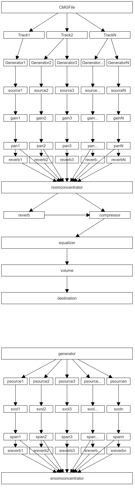
   
  <em>Audio Routing Graph</em>

The upper figure presents those sources, volumes, pans, and reverbs or a generator as a single box. Each generator group is connected to the room concentrator which has a gain of 1. The lower figure illustrates a generator that creates several sources, applies volume and pan to each source. In all cases the gain for volume is 1, as the attribute has been handled in the construction of the sources signal.

The room concentrator gain output is routed to an reverb, compressor, equalizer, volume controls, and to the final destination (either computer speakers for preview or a output stream for recording). 

The reverb, compressor, and equalizer may be enabled or disabled by the user. The diagrams for each is shown below.

  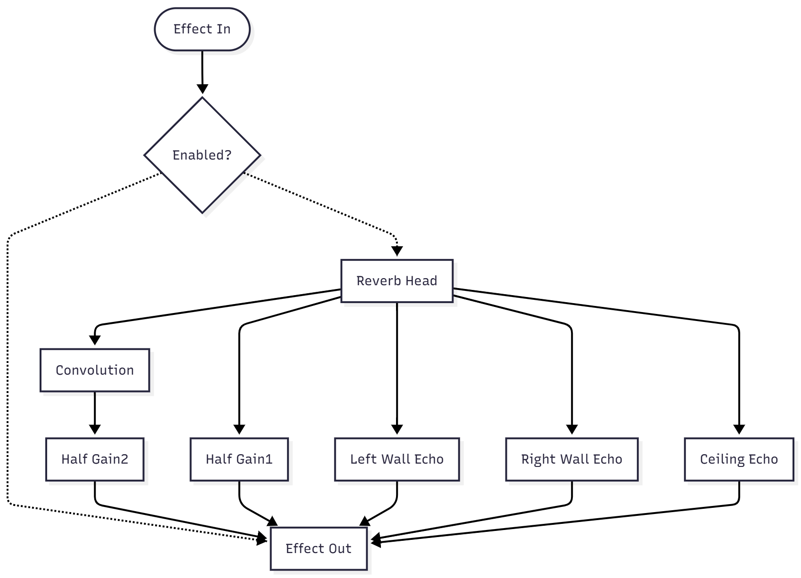
   
  <em>Room Reverb</em>

The compressor:

  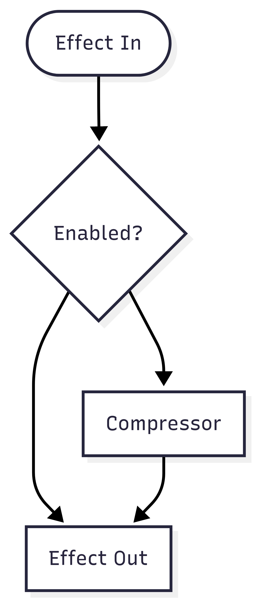
     
  <em>Room Compressor</em>

The equalizer:

  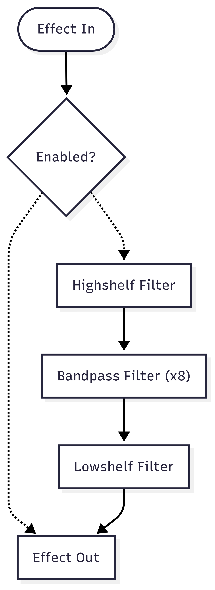
     
  <em>Room Equalizer</em>

# Application Structure

The CMG application provides several features:
1. User definition of the all of the attributes of global generation environment, including room volume, reverb, equalizer, and compressor. 
2. Display of a timeline that can be panned and zoomed, and shows the progress during preview. A interval can be defined that will select generators to be recorded or previewed. 
3. User creation, deletion, and maintenance of tracks including track renaming, solo, muting, and reordering
4. User creation, deletion, and maintenance of generators, including all attributes of each generator.
5. Preview and Record functions. During preview, the characteristics of the room volume, reverb, equalizer, and compressor may be changed. 
6. The ability save and load a defined computer music generation scenario.

The application is designed around the user interface and supported by a context. The four parts of the application are the header, body, footer, and previewer. Preview is implemented at the top level to facilitate full screen display of the preview window.

The figures below illustrate the class structure of the application. In each diagram, classes that are expanded further are highlighted in peach. In some cases the class is expanded in another diagram. 

The CMGFile class holds all of the information about a composition. 

  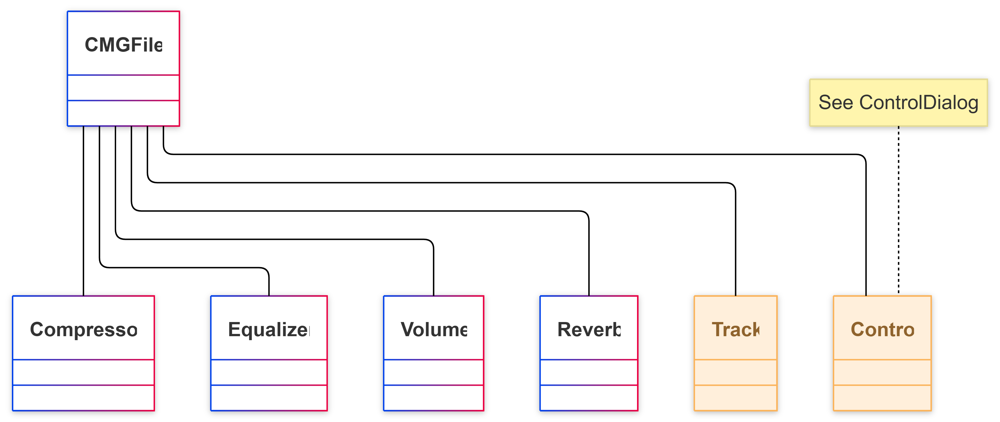
   
  <em>The CMGFile Class</em>

The Home component represents the structure of the GUI.

  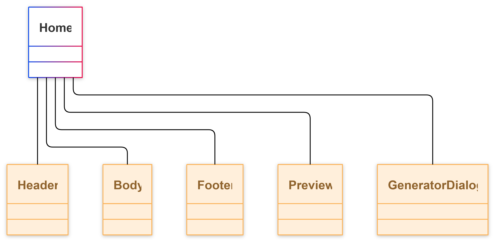
   
  <em>The Home Component</em>

The Home component represents the GUI Title, menus, and time line.

  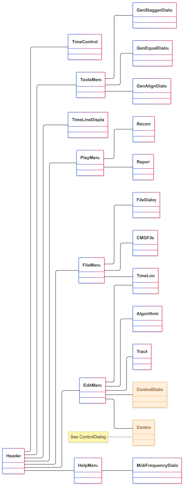
   
  <em>The Header Component</em>

The Body component represents the GUI for editting tracks and generators

  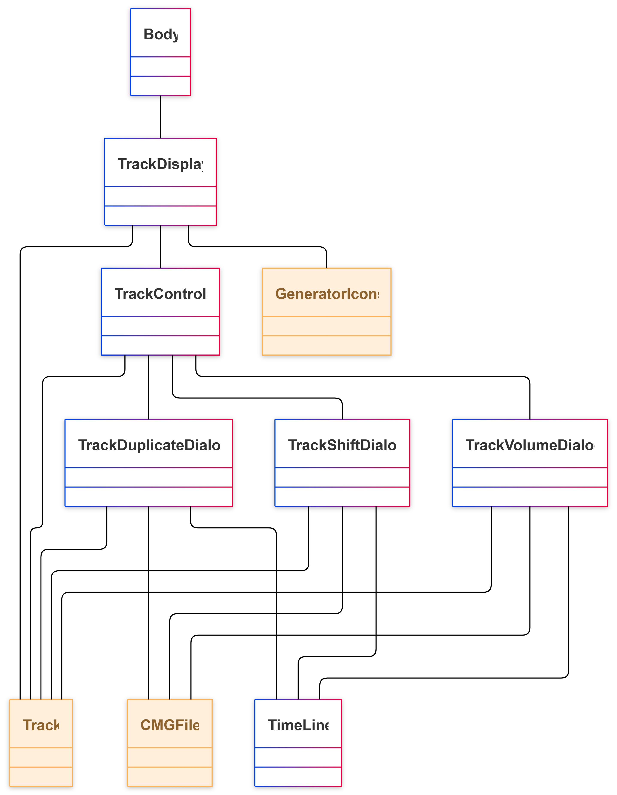
   
  <em>The Body Component</em>

The Footer component displays status message and the room level effects

  
   
  <em>The Footer Component</em>

The ControlDialog component provides maintenance of sound controls on the time line

  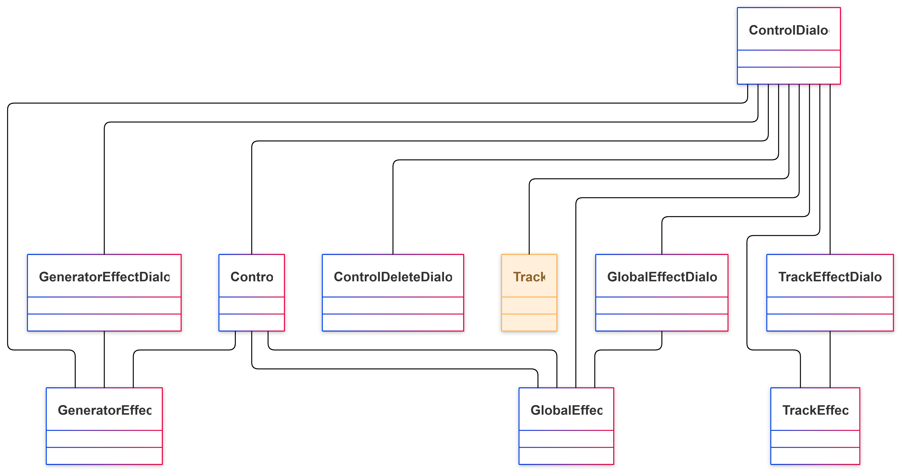
   
  <em>The ControlDialog Component</em>

The Track Class provides track objects  

  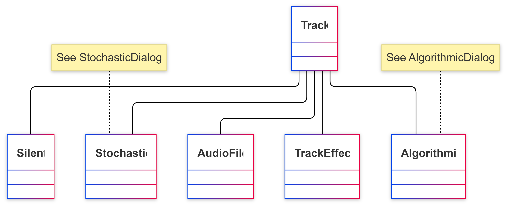
   
  <em>The Track Class</em>

The GeneratorIcons Component provides a graphical representation of a generator on a track

  
   
  <em>The GeneratorIcons Component</em>

The GeneratorDialog Component manages the dialogs for teh various types of generators

  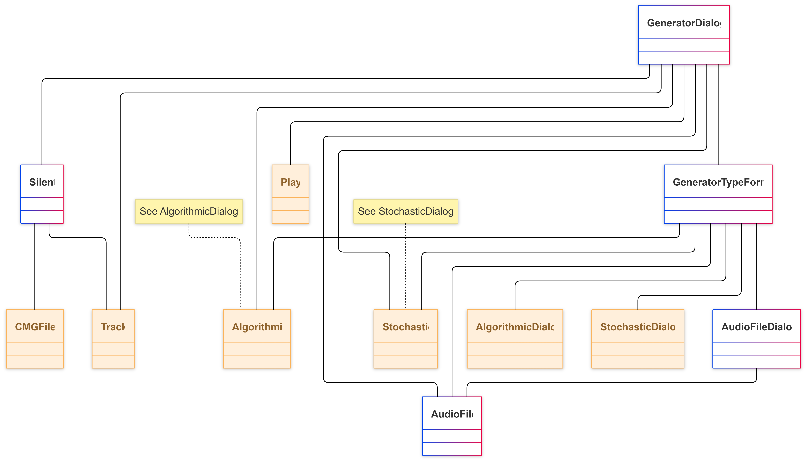
   
  <em>The GeneratorDialog Component</em>

The Play Component manages audio preview and record function.

  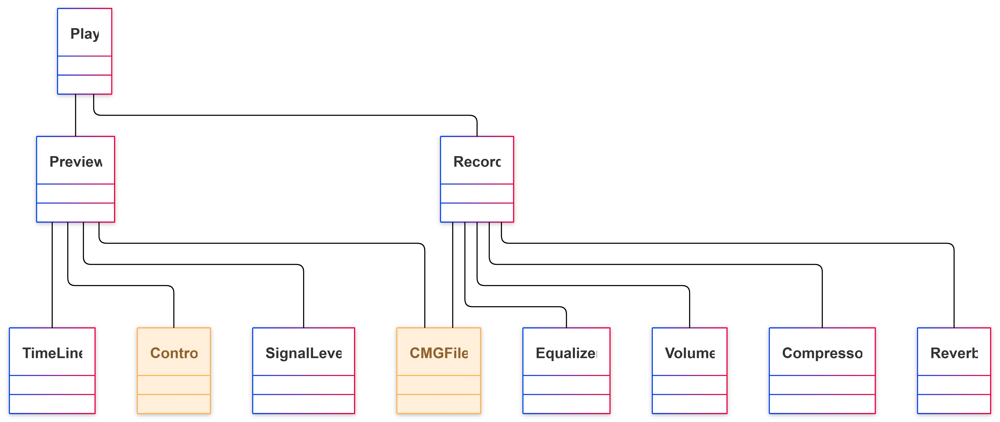
   
  <em>The Play Component</em>

The AlgorithmicDialog Component manages maintenance of a Algorithmic generator.

  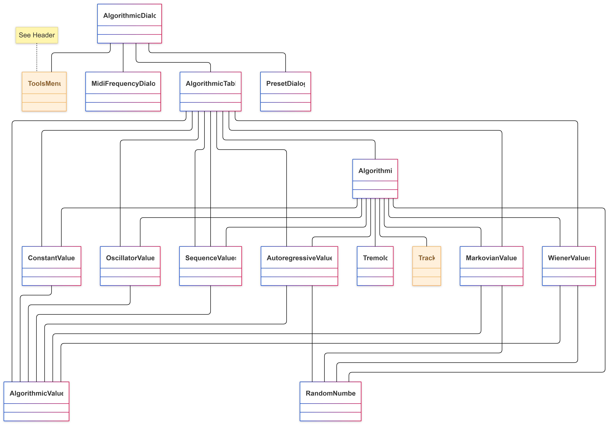
   
  <em>The AlgorithmicDialog Component</em>

The StochasticDialog Component manages maintenance of a Stochastic generator.

  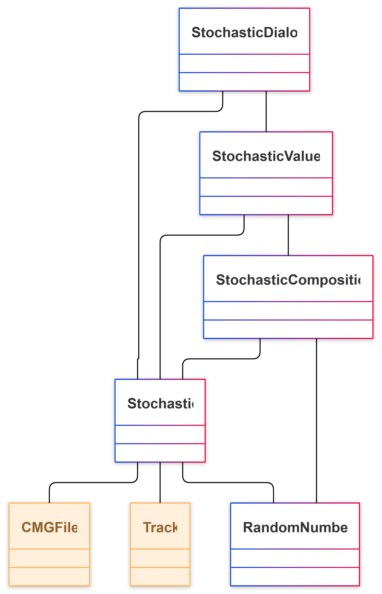
   
  <em>The StochasticDialog Component</em>

## Class Structure
Classes are used to define a number of objects used by CMG that are persisted in files while the user interface and sound generation are implemented through React functions. The general structure of the classes are
1. A set of attributes that define the objects of the class.
2. A *constructor* that requires a parameter to name the object. Other optional parameters may be present.
4. A *copy* function that makes a copy of the current object. This is used to cause React to trigger hooks when one or more of the properties of the object changes.
5. A *setAttribute* function that is called by the object maintenance functions of the user interface.
6. A *currentValues* function that returns the values for beat, velocity, note, speed, volume, and pan at a specific time.
6. An *appendXML* function that added the objects definition to an XML document to be written to external storage. 
7. A *getXML* static function that reads the object from a XML string.
7. Other methods and class objects may exist depending on needed functionality.

## Header

The header contains the app icon, a set of pulldown menus, the app title and version, the name and state of the current file being edited, and the timeline controls and display.

There are File, Edit, Play, and Help pulldown menus.
The timeline controls manage the time line display pan and zoom, time line interval.

## Body

The body as a scrollable area that holds all of the defined tracks. Each track has a control area and a display area. Track controls include delete, rename, solo, mute, move up and down the track list, and add generator buttons. Track display include 'icons' for each generator defined on the track.

A generator is created by selecting its type from a track control menu. 

The generator icons are displayed as rectangles that start and stop at the generator's times and are 1/3 of the height of the track display. This allows for movement on the icon vertically within the track display to reduce overlap. 

Each generator icon has a menu that provides for generator preview, editing, copy, move, mute, and delete functions. Generators can also be previewed through the edit function.

## Footer

The footer includes areas for a status message, reverb, compressor, equalizer, and volume attributes. 

## Preview and Record Generation

This is the business end of this application and most of the user interaction function is disabled when in either of these modes. The only interaction allowed is to pause the preview or stop the recording, or adjust the reverb, volume, equalizer, and compressor parameters while previewing. 

While previewing or recording is being done, filters are applied to determine which sources will be used to build the audio routing graph. These filters take into account the presence of a timeline interval, and track and generator solo and mute settings. An array of sources is constructed that contains all of the information needed to construct the audio routing graph.

Generation involves the building of the audio routing graph for the composition. There could be several thousand sources and related audio nodes in the full composition. Trying to realize the entire graph for preview or record is problematic and the memory required may be excessive. Scheme have been developed to only realize a portion of the graph, discard that portion and realize another portion. These schemes are different for preview and record.

Preview provides a display overlay that contains three areas:

- Header
    - buttons for exiting, starting, pausing, and resuming the preview
    - the application title, version, file, and file change status
    - the timeline 
- Body
    - one to three sections that display the sources for any instruments, percussions, or audio files that are being previewed. The vertical location of the sources within their sections depend on their pitch number. The color of the source lines varying depending on their volume (saturation), pan (hue), and current playing status (lightness).
- Footer 
    - a table enumerating the number of total and active generators and sources. A source is 'active' when it is currently being played.
    - the spectra or sonogram of the left and right channels
    - the signal levels of the left and right channels
    - room controls for the reverb, compression, equalization, and volume. 

### Preview Realization

1. An audio context is constructed to hold the dynamically changing routing graph.
2. The room level nodes are constructed and connected to the context destination (system speakers). These include a room concentrator with unity gain, and the reverb, compressor, equalizer, and volume as defined by the composition. When the sources are placed on the graph they are connected to room concentrator.
3. A scheduler is run that triggers every 25 milliseconds. This scheduler does the following every cycle.
    - All sources that are to be started within the next 100 milliseconds of the current context time, are collected into an array. They are then realized as audio nodes along with their effects, connected to the room concentrator, and started.
    - All running sources that have their stop time prior to the current time are disconnect from the routing graph.
    - When the current time is before the playback length of the composition, the next 25 milliseconds cycle is initiated. 

While the composition is being previewed, the generators that are playing are identified so that they can be highlighted on the track display.

There are three other timers used during preview:

- A one second timer that is used to update the time line and to trim the number of sources being evaluated as for starting
- A 1/2 second timer that checks for updates to the list of active generators
- A one second timer that handles updates to the signal analyzer for volume and frequency response

### Record Realization

Recording involves the rendering of portions of the audio routing graph in blocks, called batches, which are group together to enable simultaneous rendering. As each completes the resulting buffer is added to the total. When all batches are complete, the total is encoded to the selected audio file type, either WAV or MP3. Currently a batch consists of up to 200 sources, and up to 10 batches are dispatched for simultaneous rendering.

Before recording can begin, the user is asked to identify the file that is to contain the encoded audio.

1. The source are sorted in start time order.
2. The result array is constructed for left and right channels and the number of samples making up the entire playback length.
3. The number of batches is counted so it will be known when all batches have been completed.
4. A timer is used to construct up to 10 batches in for simultaneous rendering when the previous group of batches has completed. 
5. When the batches are identified the following occurs for each
    - an offline audio context is created for the batch
    - a copy of the room reverb, compressor, equalizer and volume is created and connected to the a room concentrator and offline context destination
    - the sources in the batch are realized and connected to the room concentrator
    - rendering is started for the context. When complete, the rendered buffer to added to the total, sample by sample. The number of batches completed is incremented.
6. When all batches are completed, the total is encoded to the audio file and the timer is stopped.
7. Another timer is used to update a progress bar than displayed the percentage of buffers completed or the total required. 

# Sample Generation

I have found the gain envelope feature of the Web API audio framework to be problematic. Envelope control does not have a high level of accuracy and does not always perform as desired. I have developed the following scheme to construct the audio samples for each source using information from the SoundFont preset and instruments and the user controls for note, attack, speed, duration, volume, and pan.

What follows is particular to the Algorithmic generators.

The gain envelope, in general has five different regions that may be present. The values for these are derived from the preset and instrument of the selected pitch and velocity. There may be one or more instruments associated with the pitch/velocity combination. Each of them will have its own gain envelope. The gain regions, and their SoundFont definition parameters are:
1. **Delay** - the amount of time (*delayEnd*) that the signal is zero before the instrument's sound begins (*delayVolEnv*).
2. **Attack** - the amount of time (*attackEnd*) that the signal gain changes from 0 to 1 (*attackVolEnv*).
3. **Hold** - the amount of time (*holdEnd*) that the signal gain remains at 1 (*holdVolEnv*).
4. **Decay** - the amount of time (*DecayEnd) that the signal gain goes from 1 to a sustained gain level (*decayVolEnv*). The sustain level is defined by *sustainVolEnv* and is converted to *sustainGain*.
5. **Release** - the amount of time (*ReleaseEnd*) that the signal gain goes from the sustained gain level to 0 (*releaseVolEnv*).

Below is a full gain envelope with all regions present. Not all may be in all cases depending on parameters of the note. 

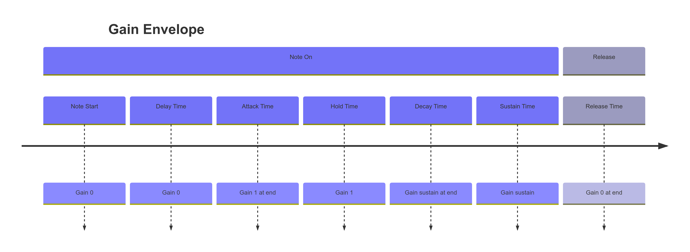

SoundFonts are normally driven by a human gesture, e.g., the press and release of a key. A key may be pressed soft or hard, thus giving it a sound a different attack. In SoundFont terminology, this is called note velocity.

CMG has certain parameters that mimic human gestures. A generator has a start and stop time, similar to pressing and releasing a key. It has a speed which defines how often notes are played during the generator start/stop period. It has a duration with is a percentage of the time between start and stop that mimics early release for staccato effects. It has an attack parameter which is the note velocity. It has a volume mimicking some form of human control, like a turning of a knob or moving of a slider.

As an example, a violin preset (000:040) in the GeneralUser-GS SoundFont file has two instruments defined that are keyed by note range and velocity range. By specify these two parameters, either one or two instruments are selected depending on the note and velocity values. For most notes, the higher velocities have an instrument that contains the samples for hard string bowing. Lower velocities do not have this instrument.

The envelope for an instrument is determined by CMG using the following scheme:
1. The instrument's playback rate is determined from the rootKey, and pitchCorrection. This playback rate and the instrument's sample rate are used to determine the sample rate for the final sample to be constructed (*sampleRate*). 
2. The instrument's sample looping parameters are read (*loop, startLoop, endLoop*). The generator's *Looping?* is used to override the instrument's loop value.
3. The time when the note is to end (*noteEnd*) is either the *Duration* or the length of time of the sample, depending on whether the sample is looping. 
4. If the sample is not looping or the duration is not the full note length, there is no release phase of the envelope and *releaseEnd* is set to *NoteEnd*.
5. All of the envelope values are read from the preset/instrument combination. 
6. The envelope is constructed as follows.
    * If *noteEnd* is less than *delayEnd* there is no sound and the envelope has one point of zero gain.
    * If *noteEnd* is between *delayEnd* and *attackEnd*, the attack is terminated early at *noteEnd*, the gain at the end of the note is determined by linear interpolation (*noteGainEnd*) and a new point is added to the gain envelope at *noteEnd* with a gain of *noteGainEnd*; otherwise, the envelope has a new point a time of *attackEnd* with a gain of 1 and *noteGainEnd* is 1 in preparation for handling the hold phase.
    * If *noteEnd* is between *attackEnd* and *holdEnd*, there is no decay phase, a new point is added to the gain envelope at *noteEnd* with a gain of 1 and if there is a release phase, a point is added at *releaseEnd* with a gain of 0; otherwise, a point is added at *holdEnd* with a gain of 1 in preparation for handling the decay phase.
    * if *noteEnd* is between *holdEnd* and *decayEnd*, there is a early decay termination at *noteEnd*, the gain at the end of the note is determined by linear interpolation (*noteEndGain*) and a new point is added at *noteEnd* with a gain of *noteEndGain*; otherwise, the envelope has a new point at time *decayEnd* with a gain of *sustainGain* and a new point is added at *noteEnd* with a gain of *sustainGain*.
    * If *noteEnd* is not *releaseEnd*, there is a release phase and a new point is added at *releaseEnd* with a gain of 0.
    * The *totalTime* is defined as *releaseEnd*.
    * There is always a point at *totalTime* with a gain of 0.

        Thus a gain envelope may have as few as one point and as many as six.

The delay and and attack phases may be bypassed if the user has disabled the attack phase. Many instruments have attack built into their samples. Applying the SoundFont generators will over emphasize this attack.  

If tremolo if active, the envelope is revised to apply the tremolo waveform. This is done by interpolating the original envelope at 10 ms intervals and applying the waveform. The number of points in the envelope will them by *totalTime/0.01*.

Once the *sampleRate* and *totalTime* are defined the samples can be determined by resampling the instrument's samples and applying noise, which is defined by *noiseFrequency* and *noiseAmplitude*. During this resampling, the *Volume* gain value for the generator is applied. The resampling scheme is as follows:

1. The initial playback rate is determined from the *cents* of the instrument,
1. The *sampleCount* is the product of *sampleRate* and *totalTime*. construct the sample array with this number of elements and initialized to zero.
1. The time spacing between samples is the reciprocal of *sampleRate*.
1. The delay time dead period has length of the product of *sampleRate* and *delayEnd*
1. The spacing between each instrument sample (*deltaIndex*) is the ratio of the instrument's sample rate and the new sample rate. This may not be an integer. Set current index to zero. This points to the instrument's sample to the used. 
1. Starting at *delayEnd*, loop through sample array, one entry at a time, incrementing the time by the time spacing
    * if the current index is less than the instrument's last sample, set the sample array to the instrument's sample with noise added (see below); 
    * otherwise, if looping, adjust the current index to the start of the loop and set the sample array to this instrument's sample with noise added
    * otherwise, there are no more instrument samples, set the sample array at this point to zero.
    * if there is vibrator active, its waveform is applied to the instruments cents and a new playback rate is calculated. 
    * The current index is increments by the play back rate and the process repeated 

Gaussian frequency modulation noise may be added to the sample if specified by the user. The noise has a dispersion of *noiseFrequency* and an amplitude of *noiseAmplitude*. The added noise is balanced with the original signal assuming that the original signal's gain is 1.

Once the sample array has been constructed by resampling the instrument's signal and applying noise, the gain envelope can be applied to it. This is a relatively simple process of interpolating the gain between envelope points and applying it to the signal.

Finally, the pan value is applied to the sample. 

# Thanks

Special thanks to various people and non-people

- My son, Ryan Lane, that got me into web-based programming and provides a sounding board for problems when I am having them. One of his web sites is a monitor of [his weather station](https://wx.mc-lane.com/).
- [sfumato](https://github.com/felixroos/sfumato) - who revealed to me the complexities of soundfont signal processing
- WebAudio documentation, particularly the authors of the page [Advanced techniques: Creating and sequencing audio](https://developer.mozilla.org/en-US/docs/Web/API/Web_Audio_API/Advanced_techniques).
- Russell Good for his blog [How to Convert an AudioBuffer to an Audio File with JavaScript](https://russellgood.com/how-to-convert-audiobuffer-to-audio-file/).
- Mathew Willox for his blog [Making Reverb with the Web Audio API](https://blog.gskinner.com/archives/2019/02/reverb-web-audio-api.html). 
- The Duckduckgo search engine and Visual Code Copilot that helped me hack my way through this.
- 'The Computer Music Tutorial', by Curtis Roads, 1996. This is an excellent book that gives the history and basic of signal processing as applied to sound. Since it was written, many algorithmic methods described there are realizable on computers in real time. 

# Versions - Changes
## 6.0.0 Release Notes (5.0.0 was never released)
## 4.0.0 Release Notes
- implemented graphical display for preview, including spectra
- refactored generator icons as it was getting quite large
- repairs to time interval processing and display
- implemented zero duration delay, attack, hold, decay, release
- repaired add generator menu and generator icon menu scrolling
- disabled all functions except stop recording and preview when playing
## 3.6.1 Release notes
- refactored generator icons as it was getting quite large
- repairs to time interval processing and display
- implemented zero duration delay, attack, hold, decay, release
- repaired add generator menu and generator icon menu scrolling
- disabled all functions except stop recording and preview when playing

## Version 3.6.0 implements
- changed Add Generator to a pull down menu in track control
- Midi notation changed to note name plus cents, e.g., C4+30
- An autoregressive algorithm for algorithmic generator
- A constant algorithm for algorithmic generator
- Updated report writer to include silent generator, and constant and autoregressive algorithms. 
- Fixed attenuation field in report writer.
- Improved mouse actions on timeline to define and move timeinterval
- implemented generator move in time and improved vertical position movement

## Version 3 implements 
- Independent algorithms for each voice parameter
- Euclidean selection of rhythm and octave notes
- Noise setting for voice samples
- User interface improvements
- Individual generator reverberation

## Remaining things to do

- consider using slow time line scrolling during preview

- Bugs
    - watch that pause/resume working properly and that the preview always starts at the proper place.
    - the general user flute preset cannot play faster than 180 BPM. It generates silence above that speed. must be something about the attack, sustain, or release. At 200BPM, the repeat rate is 300ms. The flute at pitch 72, and velocity of 63, the attack, sustain, and release are 4.8ms, 952ms, and 250ms respectively. There is no delay, hold, or decay.

# Development and Installation

This application was developed in Visual Code, using a vite/typescript project. It depends on the WebAPI interface to realize audio sounds. See the package.json file for specific packages used. 

A file dialog is used to access locally stored soundfont files. Sequencer and ensemble data are provided a MySql server.

## Typescript and Vite build tweaks

While TypeScript goes a long way towards making JavaScript strongly data typed, there is still some work that is needed. I had to have typescript compiler ignore a few lines that it was having trouble with using // @ts-ignore

Currently, I have no place to provide this application globally being devoid of any domain or virtual server. 

## Local File Server

Web security restrictions prevent file dialogs from obtaining the full path of files read and written on the local machine. This drove me to write a local file server that mimics the file dialogs in Javascript. It is used to access SoundFont files and enabled a 'recent files' capability since the full path is available to me. Since this application is full a local client with no internet dependencies, there is no security problem.

The local file server, located in the [GitHub Repository](https://github.com/Blane245/local_file_server). The README.md file has installation instructions.

## CMG Database Server

The Sequencing and Ensemble capabilities are providing by a MySql server, located in the [GitHub Repository](https://github.com/Blane245/CMGDatabaseServer)

# Generator Algorithms

The Algorithmic and Stochastic generators use various deterministic and statistical algorithms. 

* The Oscillator algorithm creates a sequence of values using sine, sawtooth, square, descending triangular, or ascending triangular wave forms. Each waveform have a center, frequency, amplitude, and phase. The waveforms are sampled at each beat and a audio source is generated that starts at that time and ends at the next beat. If the amplitude of the oscillator is zero, the value generated is the center value, equivalent to the Constant algorithm.
* The Autoregressive algorithm creates a sequence of values for the assigned voice's parameter. This is a statistical first-order autoregressive sequence of values given by the equation $$V_{i}=\alpha V_{i-1}+\sigma_i$$
where $V_{i}$ is the next value in the series, $\alpha$ is the persistence parameters, usually between -1 and +1, $V_{i}$ is the previous value in the series, and $\sigma$ is a uniformly distributed random number between -0.5 and +0.5.
        
    Each sequence value is bounded by a lower and upper limit and each move is done with a given step size.

* The Markovian algorithm creates a sequence of values for the assigned voice's parameter. This is a statistical process that has three states with probability transitions between each state. The states are  
    * keep the same value 
    * move the value up 
    * move the value down 
    
    If the state transition are such that all transition from the same state to the same state are 1, the value generated is always the starting value. Each sequence value is bounded by a lower and upper limit and each move is done with a given step size. 

* The Wiener algorithm creates a sequence values for the assigned voice's parameter. This is a statistical process that has an assigned trend and dispersion. Each sequence value is bounded by a lower and upper limit and each move is done with a given step size. Values are generated using the Wiener Process $$x_t=x_0+\alpha t+N(0,\sigma\sqrt{t})$$

    where $x_t$ is the new attribute value at time $t$, $x_0$ is initial attribute value, $\alpha$ is the trend, $\sigma$ is the dispersion variable, and $\N$ is the Gaussian noise function which generates a random variable with mean $0$ and standard deviation $\sigma\sqrt{t}$.
* A Euclidean Rhythm algorithm is used to determine a beat pattern and the notes selectable with in octave. 
    * The number of beats in the measure is specified along with the number of 'on beats'. An 'on beat' is one that will produce a sound from the current preset, while an 'off beat' is silent no matter what preset is currently active. If the measure length and on beat count are the same, all notes will be played.
    * The number of notes in an octave determines which presets are available for use by the note parameter. When the note algorithm selects a pitch value, the value is modified to the closest selectable pitch number. If the number of notes in the octave is set to 12, all notes in teh octave will be heard.
* A Gaussian noise algorithm is used to apply noise the note's sample and to select speeds for stochastic glissando voices. The Gaussian equation is  $$\varphi(z)=\frac {1}{2\pi\sigma}e^{-\frac {(z-\mu)^2}{2\sigma^2}}$$
    where $\sigma$ is the noise frequency and $\mu$ is zero.  
    
    The noise amplitude determines the gain of the noise signal. The frequency of the noise is given in hertz. If the amplitude or frequency is 0, no noise is applied. The equation for the signal after adding the noise is $$s(t)=\frac {sin(2\pi(s_i(t)+\varphi(\rho))t)}{(1+\sigma)}$$ where $s(t)$ is the signal with applied noise, $\rho$ is a Gaussian-distributed random number, $t$ is the time and $s(t)_i$ is the instrument's signal at time $t$.

    The glissando speed is such that $\mu$ is zero, providing to rising and falling glissandi, $\sigma$ is proportional the sonic density $\delta$
* The Possion Distribution is used to create a composition for a stochastic generator. $$\varphi(k)=\frac {\lambda}{k!}e^{-\lambda}$$ where $\lambda$ is the average number of sound events in each time interval, and $k$ is the number of events.
* The first law of Continuous Probability is to determine the duration of a voice instance for a stochastic generator. $$\varphi(x)=ce^{-cx}dx$$ where $c$ is the density of events.
* The second law of Continuois probability is used by the stochastic generator to determine intervals of pitch, intensity, density, pan.
$$\varphi(j)=\frac {2}{a}(1-\frac {j}{a})dj$$

It should be noted that CMG does not use the gain values of the Gain node or the panner values of a Panner node in the Web API. It also set the sample playback rate to one as resampling is done by the source building engines. getPresetNode.tsx and buildPresetSample.tsx functions. These are a rather complex routine and is described in detail in the Sample Generation section.

    * Diffuse reverberation may be applied to a generator. This uses a Web API Audio Convolution filter with user-specified delay and decay times.
