

**Table of Contents**
- [Introduction](#Introduction)
- [Handling CMG Files](#HandlingCMGFiles)
  - [Creating a New CMG File](#CreatingaNewCMGFile)
  - [Saving a CMG File](#SavingaCMGFile)
  - [Opening a CMG File](#OpeningaCMGFile)
- [Selecting a SoundFont File](#SelectingaSoundFontFile)
- [Editing Tracks](#EditingTracks)
  - [Tracks and Generators](#TracksandGenerators)
  - [Adding and Modifying Generators](#AddingandModifyingGenerators)
- [Editing Generators](#EditingGenerators)
  - [Generator Types](#GeneratorTypes)
  - [Generator Pulldown Menu](#GeneratorPulldownMenu)
  - [Moving a Generator Within Its Track](#MovingaGeneratorWithinItsTrack)
- [Handling the Timeline](#HandlingtheTimeline)
  - [Timeline Interval](#TimelineInterval)
- [Room Level Functions](#RoomLevelFunctions)
  - [Room Compressor](#RoomCompressor)
  - [Room Equalizer](#RoomEqualizer)
- [Previewing and Recording](#PreviewingandRecording)
  - [Recording](#Recording)
  - [Previewing](#Previewing)
  - [Preview Marker](#PreviewMarker)
- [Glossary](#Glossary)

# Introduction

The Computer Music Generator (CMG) application was inspired by the book [Formalized Music: Thought and Mathematics in Composition](https://en.wikipedia.org/wiki/Formalized_Music), by Iannis Xenakis, which I read many years ago and am just getting around to implementing something. It implements some of the features that Xenakis layout and introduces some other concepts. It will be enhanced as I locate other computer music generation concepts, most notably the use of the Euclidean algorithm to implement rhythm.

The features of the CMG include:
- Retention of defined sound generation files between working sessions,
- The use of SoundFont files to produce Midi sounds,
- The separation of sound generator into tracks that mimics the parts in a music score,
- Three types of sound generators,
- Room level sound compression and equalization, and
- Previewing and recording of generated compositions

An example of a composition in progress is shown here with the various areas of the screen notated:

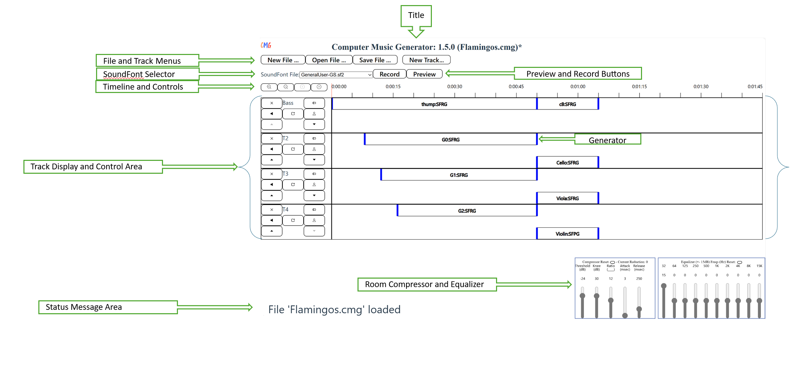

# Handling CMG Files 

CMG files are handled by the File Menu Items:

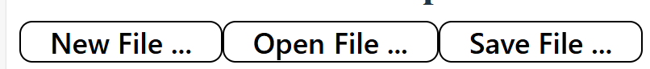

## Creating a New CMG File

When CMG starts, it has the structure of a new file with no SoundFont file, default room compressor and equalizer settings, and no tracks or generators. At any time, the menu item ***New File...*** can be selected to clear the existing workspace. If changes have been made to the workspace since the last save, you will prompted to confirm that you want to delete these changes without saving: 

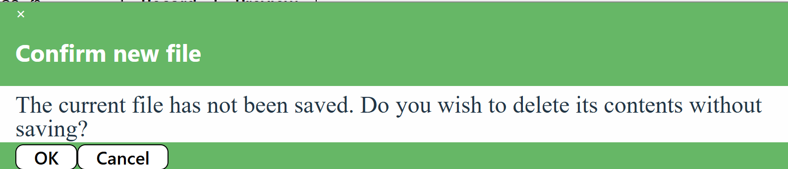

> 
*Note: The CMG screen header shows the name of the file currently being edited. If changes have been made since the last save, an asterisk (*) will follow the file name.
 

## Saving a CMG File

CMG files are created by accessing the menu item ***Save File...*** or by pressing **ctrl-s** on the keyboard. Files may be placed anywhere that they can be accessed within the file system. Files are saved with a ***.cmg*** extent. If the file already exists, you will be prompted to agree with overwriting the existing file. This saves the name of the SoundFont file, the room compressor settings, room equalizer settings, and all of the tracks and generators defined. 

> 
*Note: Long projects contain a lot of data and take some time to create. Ensure the file is fully saved before existing CMG or shutting done the computer.  The Status Bar at the bottom shows a message when the file has been saved.
 

## Opening a CMG File

CMG files are opened by clicking the menu item ***Open File...*** button or by pressing **ctrl-o** on the keyboard. Files with the extent of ***.cmg*** are displayed and the one selected will be read. This includes all of the items that were saved (SoundFont file, room compressor setting, room equalizer settings, and all tracks and generators).

# Selecting a SoundFont File

The CMG application has a library of available SoundFont files that are used by a some of the sound generators. SoundFont files contain sample-based synthesize sounds that are most frequently used by MIDI (Musical Instrument Digital Interface) devices. There are hundreds of SoundFont files existing today. This application has a small collection of them available. More can be added as desired. 

One SoundFont file can be selected for use by a CMG composition. It is selected from the list of those available using the selection pulldown:

*Note: Changing from one SoundFont file to another is allowed but may have a undesirable side effect. If there are generators existing that are using presets from the current SoundFont file, these will be remapped to those in the new SoundFont file using the bank and channel number of the preset (not the name). If none exists in the new file, the first preset is assigned and a warning message displayed.
 

More information about SoundFont files can be found in [Wikipedia](https://en.wikipedia.org/wiki/SoundFont).

# Editing Tracks

The computer generated piece of music is constructed by defining tracks and placing generators along them at various start time and end times. By clicking the menu item ***New Track...*** button a new track is added to the end of the list of existing tracks.

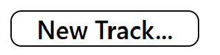

The new track is given a unique name that starts with **T** and ends with a number which is unique from all other existing tracks. The track is displayed with a control section on the left side and a timeline display on the right.

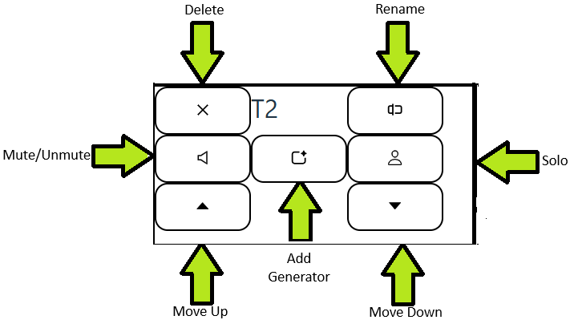

The control section displays the name of the track and provides several track level functions:
* **Delete**: A track may be deleted by clicking this button. A track delete confirmation screen is displayed requesting confirmation of the deletion. 

>>
* **Rename**: A track may be renamed as long as the new name is different from existing track names. 

>>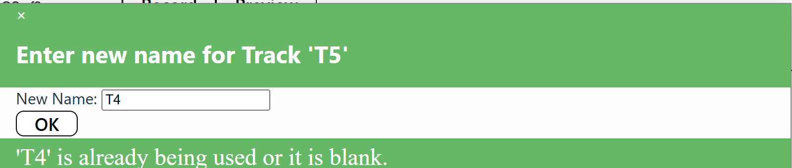
>>The new name for the track must be different from all other existing tracks. If it is not, a message will be displayed at the bottom of the rename panel. The panel can be dismissed by clicking the x at the upper left hand corner of the panel.

* **Solo**: A track may be soloed when previewing or recording. All tracks that are soloed are played together and others are ignored. A track is taken in and out of solo each time the button is clicked. The track solo setting is ignored when a timeline interval is active. See the Section on the [Timeline Interval](#timelineinterval) for more details.

* **Mute**: a track may be muted when previewing or recording. A track is muted or un-muted each time the button is clicked. When a timeline interval is active, this setting is ignored.

* **Move Up**: When this button is clicked, the track is moved above the track immediately above it. The upper most track cannot be moved up.

* **Move Down**: When this button is clicked, the track is moved below the track immediately below it. The lowest most track cannot be moved down.

* **Add Generator**: When this button is click, a dialog pane is opened to add a new generator to the track. The initial name of the generator is unique to all generators in the file. See the section below for more details about adding and editing generators.

# Editing Generators

Generators are the heart of CMG. There can be as many generators in a CMG file as is needed to produce the composition desired. There four types of generators: one place holder and three sound producers.

Two of the generators used the first instrument defined in a SoundFont preset. Each preset has a bank, channel number, and name. More information about SoundFont presets can be found [here](https://www.synthfont.com/Tutorial6.html).

## Generator Types

1. Computer Music Generator (**CMG**). This generator does not produce any sound. It role is a placeholder on the timeline. It is used by the other generators to define the time that the sound generator start and stops. 
2. SoundFont Programmed Generator (**SFPG**). This generator creates repetitive sequences of notes using sine, sawtooth, square, or triangular wave forms. Pan and volume have the same repetitive generators. Each waveform have a center, frequency, amplitude, and phase. The waveforms are sampled at 10 times a second and a sound generated that starts at that time and ends 0.1 seconds later, to be followed by another audio source until the stop time for the generator is reached.
Starting notes are taken from a SoundFont file preset.

3. SoundFont Random Generator (**SFRG**). This generator creates [Markov Chains](https://en.wikipedia.org/wiki/Markov_chain) of notes, speeds, volumes, and panning. This is a 4-dimensional Markovian process where each dimension has three states with probability transitions between each state. The states are  
>* keep the same value 
>* move the value up 
>* move the value down 
>>>The transition between states in illustrated here

>>>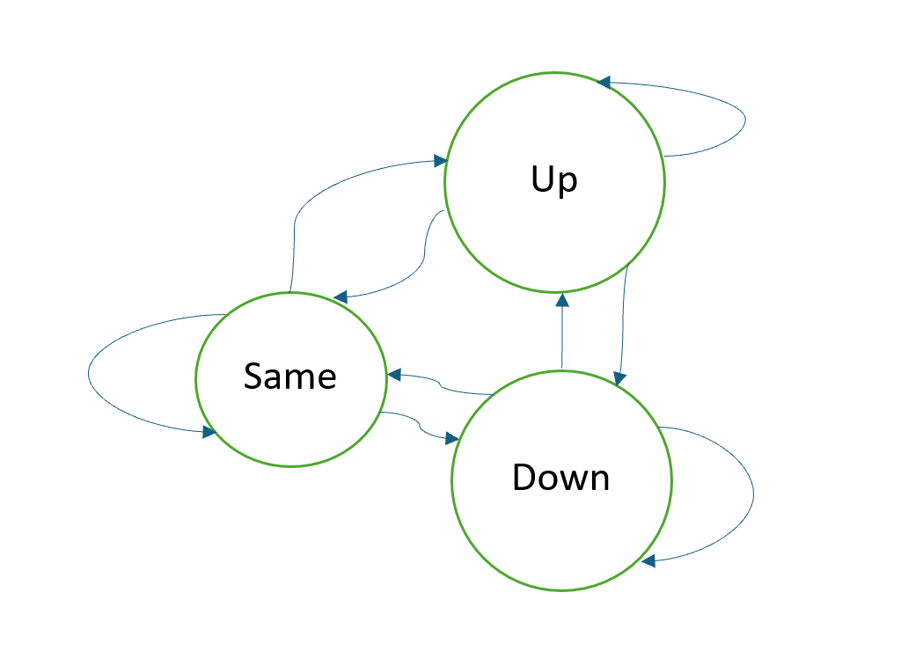

>>>Each sequence is bounded by a lower and upper limit and each move is done with a given step size. The speed dimension controls the time at which each transition in the other dimensions occur. When an attribute hits an upper or lower limit, the value is reversed. For example, if pan is already at its upper limit (right) and the suggested value is to move further up (right), the value is changed to move down (left). Thus, the containment walls are not 'sticky'. The number of sources in a SFRG depends on the length of the generator time and the time frame of each random interval. Starting notes are taken from a SoundFont file preset. 

3. Noise Generator (**Noise**). This generator will create white or Gaussian noise from the start to stop time. It is broken up into 0.1 second duration sources for this interval to provide for volume and pan changes to occur during this period. Gaussian noise have a center frequency (Hz) and standard deviation (gain) that is applied to the amplitude of the noise. Volume and pan values have center, amplitude, frequency, and phase values and have the same repetitive types as SFPG.

## Tracks and Generators

Each generator is placed on a track at its start and stop time interval. The name of a generator must be unique within the CMG file to which is belongs. A visual example of tracks and generators in shown below. 

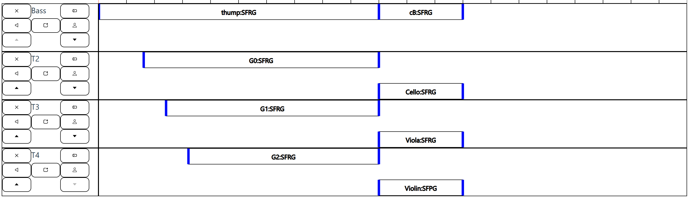

In this figure are shown four tracks, each of which has one or more generators. The first track has been renamed ***Bass***. Some of the generators have been renamed and they are all of type SFRG. 

## Adding and Modifying Generators

Generators are added by selecting the [**Add Generator**](#addgenerator) option of the track of which it is to be added. Generators are modified by selecting the [edit generator pulldown menu item](#editing-generators). 

### CMG

The placeholder generator, CMG, contains the name of the generator, its start and stop times. The type is CMG. When the type is changed, the add/edit panel changes to the selected type. 

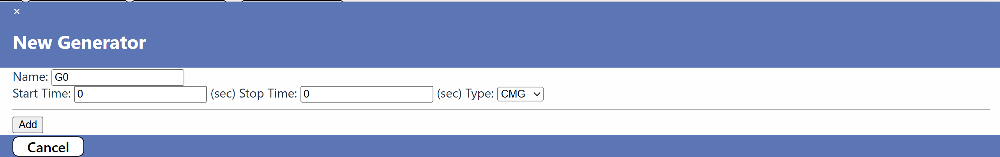

The figure shows the panel for adding a new generator, which is its title. There is an **Add** Button. When a generator is modified, the title is the name of the generator and the button is displayed as **Modify**.

The name of the generator must be unique within all generators in the file. When a new generator is created the default name is a 'G' followed by a unique number. 

The start and stop times must both be greater than zero and the stop time must be greater than the start time. 

If the name is not unique or the start and stop times are incorrect, and error message will be displayed in the footer when the Add/Modify button is clicked.

### SFPG

When the generator type is selected as SFPG, the Add/Edit panel for that type is displayed:

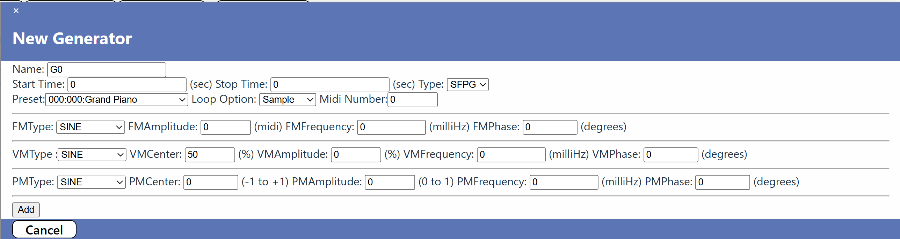

The fields are defined as follows along with their restrictions. 

- **Preset:** This is a selection list that identifies which SoundFont preset is to be used by this generator. The presets display their bank, channel number, and name. Only presets available within the SoundFont file can be selected. 

- **Loop Option:** Instrument samples contain sounds that are produced for for a certain amount of time. If the sound needs to be played for longer than the sample, then a sample loop is defined. This is part of the SoundFont protocol. This option allows the default behavior to be overridden. There are three options:
    - **Sample** - This is the default and performing loop as defined by the instrument.
    - **Beginning** - Default looping is ignored, and the sample is looped from its beginning to its end.
    - **None** - No looping is performed. The sound stops when the end of the sample is reached.

- **Midi Number:** This is the midi number of the starting sound. Midi number range from 0 to 127 and correspond to tones of C0 to G9 from the [Acoustical Society](https://acousticalsociety.org/) of America convention. When a midi number is entered, its note name is displayed next to the entry box. Fractional numbers may be entered. For example is 60.5 is entered the note name is displayed as *C4+*

The Preset, Loop Option, and Midi Number are fields common to both the SFPG and SFRG generators. The following fields are unique to the SFPG generator. **FM** stands for Frequency Modulation.

- **FMType:** This is the type of oscillator used to modify the midi number over time. It can be either *Sine*, *Square*, *Triangle*, or *Sawtooth*. 
- **FMAmplitude:** This is amplitude of the FM oscillator in midi numbers. For example if the amplitude is 6 and the midi number is 50, then the generated midi number will vary from -44 t0 56 over time. The amplitude must be between 0 and 127 in steps of 1. If the amplitude is 0, then a constant tone is generated at the midi number.
- **FMFrequency:** This is the frequency of the FM oscillator expressed in *mHz*. The frequency must be between 0 and 1,000,000 in steps of 1.
- **FMPhase:** This is the phase of the FM oscillator expressed in *degrees*. The phase must be between -360 and 360 in steps of 1.

The following fields are common to the SFPG and Noise generators. They affect the volume and pan modulations. **VM** stands for Volume Modulation and **PM** stands for Pan Modulation

- **VMType:** This is the type of oscillator used to modify the volume over time. It can be either *Sine*, *Square*, *Triangle*, or *Sawtooth*. 
- **VMCenter:** This is the center volume of the volume oscillator expressed in percent. It must be between 0 and 100 in steps of 1.
- **VMAmplitude:** This is amplitude of the VM oscillator in percent. Zero is mute and 100 is full volume. The amplitude must be between 0 and 100 in steps of 1. If the amplitude is 0, then a constant volume is generated at the center volume.
- **VMFrequency:** This is the frequency of the VM oscillator expressed in *mHz*. The frequency must be between 0 and 1,000,000 in steps of 1.
- **VMPhase:** This is the phase of the VM oscillator expressed in *degrees*. The phase must be between -360 and 360 in steps of 1.
- **PMType:** This is the type of oscillator used to modify the pan over time. It can be either *Sine*, *Square*, *Triangle*, or *Sawtooth*. 
- **PMCenter:** This is the center pan of the pan oscillator. It must be between -1 and 1 in steps of 0.1.
- **PMAmplitude:** This is amplitude of the PM oscillator in percent. -1 is left, 0 is center, and 1 is right. The amplitude must be between 0 and 1 in steps of 0.1. If the amplitude is 0, then a constant pan is generated at the center pan.
- **PMFrequency:** This is the frequency of the PM oscillator expressed in *mHz*. The frequency must be between 0 and 1,000,000 in steps of 1.
- **PMPhase:** This is the phase of the PM oscillator expressed in *degrees*. The phase must be between -360 and 360 in steps of 1.

### SFRG

When the generator type is selected as SFPG, the Add/Edit panel for that type is displayed:

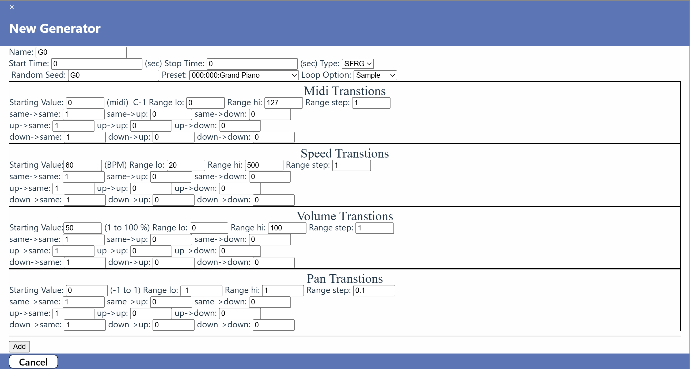

There are quite a number of fields on this panel:

- **Random Seed:**The is a character string that is used to start the random number sequence for this generator. It defaults to the initial generator name, which is not a particularly good value and should be changed. Each of the SFRG and Noise generators have their own seed. These can be the same as another generator if it is desired to have the generator state transitions coupled. 
- **Preset:** This is described [here](#preset).
- **Loop Option:** This is described [here](#loopoption).

Any of the fields define state transition probabilities between the various states of the Markov Chains for the midi number, the speed, the volume, and the pan. At any time, each of the variables (midi number, speed, volume, and pan) have a specific value. When it is time to determine a new value, a transition from one state to the next is determined by drawing a random number and determining which transition is to be made. Each of the 9 transitions may have a different value but the sum of the three transitions out of a state and into another must sum up to one and each must be less than or equal to 1 and greater than or equal to 0. The figure below illustrates a example where a variable will never stay at the same value and will have a probably of 0.5 of going either up or down.
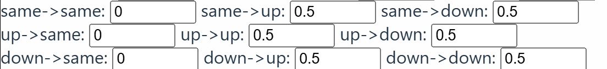
If it desired that no change should be applied to a variable, then assigned a probably of 1 of a transition from any state to the **same** state should be 1 and other transition probabilities should be 0. These are the default values.

All variables have three transition probabilities. What remains to describe are the starting values and ranges.

#### Midi Transitions

- **Starting Value:** This is the midi number where the sequence of tones starts. Its properties are described [here](#midinumber). It must be between *Range lo* and *Range hi*.
- **Range lo:** This is the lowest value that can be assigned to a midi number. It must be in the range 0 to 127 and be smaller than the hi value.
- **Range hi:** This is the highest value that can be assigned to a midi number. It must be in the range 0 to 127 and be larger than the lo value.
- **Range step:** This is number to add or subtract from the current midi number to determine the next midi number when a state is changed. It must be less than or equal to the difference between *range hi* and *range lo*.

#### Speed Transitions

- **Starting Value:** This is the speed (in beats per minute(BPM)) where the sequence of speeds starts. It must be between 5 and 500 with a step size of 5. 
- **Range lo:** This is the lowest value that can be assigned to a speed. It must be between 5 and 500 with a step size of 5.
- **Range hi:** This is the highest value that can be assigned to a speed. It must be between 5 and 500 with a step size of 5.
- **Range step:** This is number to add or subtract from the current speed to determine the next speed when a state is changed. It must be less than or equal to the difference between *range hi* and *range lo* and value a value from 0 to 500 with a step size of 1.

#### Volume Transitions

- **Starting Value:** This is the volume (in percent) where the sequence of volumes starts. It must be between 0 and 100 with a step size of 10. 
- **Range lo:** This is the lowest value that can be assigned to a volume. It must be between 0 and 100 with a step size of 1.
- **Range hi:** This is the highest value that can be assigned to a volume. It must be between 0 and 500 with a step size of 1.
- **Range step:** This is number to add or subtract from the current volume to determine the next volume when a state is changed. It must be less than or equal to the difference between *range hi* and *range lo* and value from 0 to 100 with a step size of 1.

#### Pan Transitions

- **Starting Value:** This is the pan where the sequence of pans starts. It must be between -1 (left) and +1 (right) with a step size of 0.1. 
- **Range lo:** This is the lowest value that can be assigned to a pan. It must be between -1 and +1 with a step size of 0.1.
- **Range hi:** This is the highest value that can be assigned to a pan. It must be between -1 and +1 with a step size of 0.1.
- **Range step:** This is number to add or subtract from the current pan to determine the next pan when a state is changed. It must be less than or equal to the difference between *range hi* and *range lo* and value from -1 to +1 with a step size of 0.1.

### Noise

The Noise generator has two options: the noise may be white noise or Gaussian noise.
- **Type:** This can be either *white* or *gaussian*. 

There are two fields in common between the noise types:

- **Sample Rate:** This is the rate at which the sound samples are generated in Hz. The default value is 44,100Hz, which is a commonly used sample rate. The sample rate must be between 15,000Hz and 50,000Hz with a step size of 100Hz.
- **Random Seed:** This is described [here](#randomseed)

.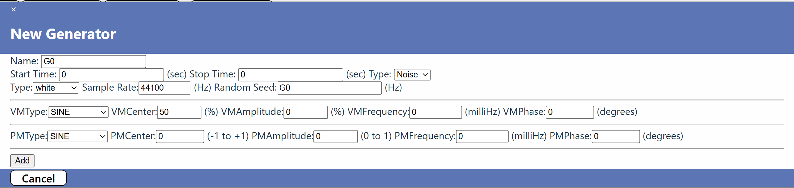

The Gaussian nose generator has a couple of addition fields that define the center frequency of the noise and its standard deviation:

- **Frequency:** The center frequency of the Gaussian noise in Hz. It must be between 20Hz and 20,000Hz, with a step size 0.01.
- **Standard Deviation:** The standard deviation of the amplitude (gain) of the Gaussian noise. It must be between 0 and 1 with a step size of 0.01.
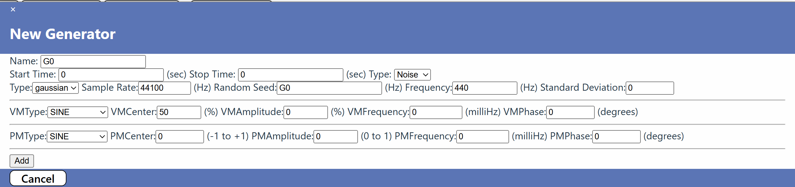

The rest of the fields for the Noise generator are the same as those for the SFPG generator as defined [here](#commonfields)

## Generator Pulldown Menu

Each generator has a pulldown menu that is activated by clicking on the name of the generator in the track timeline display. 

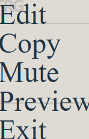

The following functions are available:

- **Edit** A entry panel is displayed containing all of the values of the fields for the generator. All fields can be modified. If the *Delete* button is clicked a confirmation panel will be displayed before the deletion occurs:
>>>
>>> 
*Note: Changing the generator type will cause all of the values currently assigned to be forgotten.
 
- **Copy** A panel is displayed providing the means to copy the selected generator to any of the existing tracks. The default is the track where the generator currently lies. A new generator is created with all of the same values as the selected generator, except a unique name is assigned to it. The panel may be exited by either clicking *Cancel* or the *x* in the upper left hand corner of the panel. 
>>>
- **Mute/Un-mute** A generator may be muted or un-muted. This affects whether or not it will be heard during Preview or Record. When a generator is muted, its text is displayed in red. 
- **Preview** The sound created by the generator may be previewed on its own without hearing any other generators. The sound will start as if the generator had been defined to start a time 0 (the start of the composition). See [Preview](#preview) for more details.
- **Exit** The generator pulldown menu is hidden.

## Moving a Generator Within Its Track

Each generator is displayed as an icon with its length determined by its start and stop time and the current timeline settings. Its height is 1/3 of the height of the track timeline display. A generator icon may overlap other icons on the timeline display so it may be desirable to move it away from the others. A generator may be vertically up or down by clicking anywhere in the icon except the title and dragging the mouse up or down. When the mouse is released, the icon assumes its new position. This position becomes part of the generator's properties and is saved in the CMG file.

# Handling the Timeline
The Timeline is a window of a slice of time into the full composition. It can be scrolled and zoomed as desired to best display the generator icons as a composition be being constructed. The figure below is an example of a timeline with the controls display on the left side and the time scale shown to the right. 
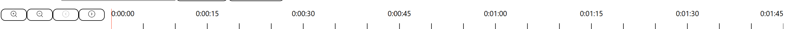
- **Scroll** The timeline can be scrolled either left or right by clicking the left arrow or right arrow buttons in the timeline control area. The timeline cannot be scrolled left further than time zero and right further than several years.
- **Zoom** The timeline can be zoomed in or out to reveal more or less detail by clicking the zoom in or zoom out buttons. The zoom function has both maximum and minimum zoom levels. Each zoom roughly doubles or halves the resolution of the timeline. The time values and tick marks are displayed appropriately to the zoom level in hours, minutes, and seconds.

The scroll and zoom functions of the timeline control how the generator icons are seen. Each generator has a start and stop time which may or may not be with the currently displayed timeline. Only part or none of the generator icon may be seen at any particular timeline setting.  

## Timeline Interval
One of the filters for previewing and recording is the timeline interval. This filter defines which generators are selected and overrides the other filters of muting or soloing of tracks and generators. A timeline interval has a start and end time. Generator whose start and stop time fall with the timeline interval are selected. 

A timeline interval is defined by mouse actions within the timeline. When the mouse moves into the timeline, the cursor changes to an *crosshair* cursor indicating that an interval can be defined. If there is a interval defined, the cursor will change either to a *grab* cursor or a *ew-resize* cursor depending on whether the mouse of within an displayed interval or on one of its edges.

This figure illustrates a typical timeline interval with the selected generators.

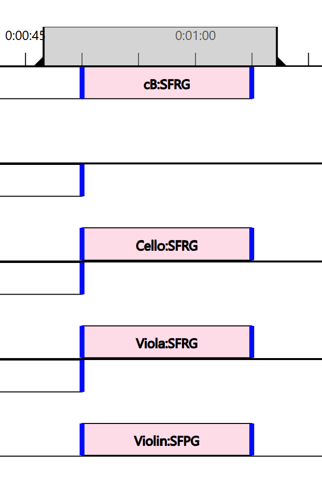

- **Defining a timeline interval** This is initiated when a *crosshair* cursor is displayed. Clicking the mouse button and dragging either left or right will define a new interval. When the mouse button is released the interval becomes fully defined and the generators contained within it are highlighted.
- **Moving the timeline interval** When the mouse is within the interval and the 'grab' icon is display. A left mouse click with a drag left or right will move the interval. Once the mouse is released the new position is finalized and the generators contained with in are highlighted.
- **Moving the start or end of the timeline interval** When the mouse is moved over either the start or end of the timeline interval, an *ew-resize* cursor is displayed. A left mouse click with a drag left or right will move the selected end of the interval. Once the mouse is released the new end point is finalized and the generators contained within the interval are highlighted.

# Room Level Functions
During the rendering of a generated sound composition, all of the sources from all of the active generators are pulled together to allow for room level audio modulators or compression and equalization to be applied. These modulators are applied to all of the source sources as an aggregate. The parameters of the compressor and equalizer are part of the CMG File definition and are saved so they can be loaded later. The compressor and equalizer are in the left hand corner of the screen. Their values are set by the use of sliders. These values may be rest to defaults by pressing the *Reset* buttons. 
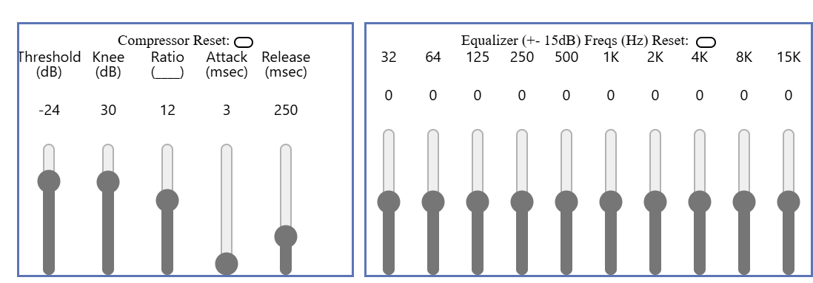

## Room Compressor 

The compressor is a [DynamicsCompressorNode](https://developer.mozilla.org/en-US/./Web/API/DynamicsCompressorNode). 
There are five controls to the compressor:
- **Threshold** The decibel (dB) level where the compressor will start taking effect. The threshold default is -24dB and has a range of -100dB to 0dB. 
- **Knee** The dB level representing the range above the threshold where the curve smoothly transitions to the compressed portion. The default value is 30dB and the range is 0dB to 40dB.
- **Ratio** The change, in dB, needed in the input for a 1 dB change in the output. The default value is 12 and the range is 1 to 20.
- **Attack** The time, in seconds, required to reduce the gain by 10 dB. The default value is 3 ms and the range is 0 ms to 1,000 ms.
- **Release** The time, in seconds, required to increase the gain by 10 dB. The default value is 250 ms and the range is 0 ms to 1,000 ms.

The amount of *reduction*, in dB, currently being applied to the signal appears ion the compressor title line during preview.

The compressor values may be reset to defaults by clicking the compressor reset button.

## Room Equalizer
The equalizer has 10 frequency band filters, roughly spaced 1 octave apart. The lowest band is a *lowshelf* filter. The highest band is a *highshelf* filter, and the remaining 8 are *peaking filters. The *Q* value for the peaking filters is defined as the ratio between the frequency of the filter and the next higher filter, which is roughly 2. 

The frequencies of the equalizer are not adjustable, but the gains are. They may be varied from -15 to +15 by moving the gain slider. The default values for all filter gains is 0, which can be restored by clicking the equalizer reset button.

# Previewing and Recording
The whole idea of this application is to produce sound from the defined generators. This is accomplished using the Preview and Record buttons. The buttons are only active when there is at least one generator defined that can produce sound. When either *Preview* or *Record* is selected, a *Stop* button will appear allowing the review or record to be prematurely stopped. 

> 
*Note: All input functions are disabled, except the room compressor and equalizer until the preview/record is stopped or completed. (*) will follow the file name.
 

Generator selection occurs by evaluating some filters:
- **Timeline Interval** If a timeline interval is defined, only the generators that are selected by the timeline will be previewed or recorded. The time of the preview or record is started at the start time of the earliest selected generator.
- **Active Generators** Tracks may be soloed or muted and generators may be muted. All of the tracks and generators are checked for these conditions. If a track is both muted and soloed, solo takes precedence. 
>>> 
*Note: CMG generators produce no sound are are removed in any case.

If there are no generators that pass these tests a panel is displayed 
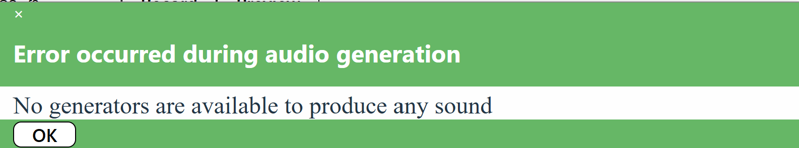

## Recording

When the *Record* button is clicked, you will be prompted to provide a file name and location where the result .wav file will be placed. Once that has been identified, the selected generators are rendered and the wave file is written. 

## Previewing

When the *Preview* button is clicked, the selected generators will begin to produce sound through the system sound drivers in realtime. As each generator becomes active, it will be highlighted indicating that is contributing to the overall sound at that time. 

If a generator is previewed by selection of generator preview option, or generators are selected via the timeline interval, the generators start times are moved such that the earliest start time is at zero. This avoids waiting until the generator would normal start before it is heard.

## Preview Marker

When previewing, the current time of the soundtrack is shown by a moving red vertical line on the timeline. This line advances are time progresses. 

# Glossary
The definition of many of the terms used in this manual can be found online, particularly at Wikipedia. 
| Term | Meaning |
| ----------- | ----------- |
| SoundFont File | SoundFont files contain sample-based synthesize sounds that are most frequently used by MIDI (Musical Instrument Digital Interface) devices. More information about SoundFont files can be found in [Wikipedia](https://en.wikipedia.org/wiki/SoundFont). |
| MIDI Number | Musical Instrument Digital Interface (MIDI) continuous control number (CCN). A values used to select which sample from a preset is to be used by a generator.  |
| Preset | A soundFont preset is a collection of instrument samples that are used to make up the a sound. Presets are identified by a bank number, a channel number, and a name. CMG only uses the first instrument in a preset collection of instruments to produce sound. |
| Markov Chain | This is used by the SFRG generator and is best described by [Wikipedia](#https://en.wikipedia.org/wiki/Markov_chain) |
| Sound Compression | Audio Dynamic Range Compression, not to be confused with Data Compression is best described in [Wikipedia](#https://en.wikipedia.org/wiki/Dynamic_range_compression) |
| Sound Equalization | This is best described by [Wikipedia](#https://en.wikipedia.org/wiki/Equalization_(audio))  |
| Low Shelf filter | This is best described by [Wikipedia](#https://en.wikipedia.org/wiki/Filter_design) |
| Peaking Filter | This is a band-pass filter as defined by [Wikipedia](#https://en.wikipedia.org/wiki/Band-pass_filter)  |
| High Shelf Filter | This is best described by [Wikipedia](#https://en.wikipedia.org/wiki/Filter_design) |
| Q Value | This is parameter os a band-pass filter as defined by [Wikipedia](#https://en.wikipedia.org/wiki/Band-pass_filter) |

