
Computer Music Generator (CMG) User's Guide, Version 6.0.0
========================================================
**Table of Contents**
- [Introduction](#introduction)
- [Handling CMG Files](#handling-cmg-files)
  - [Create a New CMG File](#create-a-new-cmgfile)
  - [Opening a CMG File](#opening-a-cmg-file)
  - [Save a CMG File](#save-a-cmg-file)
- [Edit Menu](#edit-menu)
- [Tracks](#tracks)
- [Generators](#generators)
  - [Generator Types](#generator-types)
    - [Silent](#silent)
    - [Algorithmic](#algorithmic)
    - [Stochastic](#stochastic)
    - [AudioFile](#audiofile)
  - [Generator Pulldown Menu](#generator-pulldown-menu)
  - [Moving a Generator Within Its Track](#moving-a-generator-within-its-track)
- [Timeline](#timeline)
  - [Timeline Control](#timeline-control)
  - [Timeline Interval](#timeline-interval)
  - [Sound Controls](*sound-controls)
- [Room Level Functions](#room-level-functions)
  - [Room Volume](#room-volume)
  - [Room Reverb](#room-reverb)
  - [Room Compressor](#room-compressor)
  - [Room Equalizer](#room-equalizer)
- [Previewing, Recording, and Reporting](#previewing-recording-and-reporting)
  - [Recording](#recording)
  - [Previewing](#previewing)
  - [Reporting](#reporting)
- [Intensity Transitions](#intensity-transitions)
- [CMG Database Editor](#cmg-database-editor)
  - [Sequences](#sequences)
  - [Ensembles](#ensembles)
- [Random Numbers](#random-numbers)
- [Glossary](#glossary)

# Introduction

The Computer Music Generator (CMG) application was inspired by the book [Formalized Music: Thought and Mathematics in Composition](https://en.wikipedia.org/wiki/Formalized_Music), by Iannis Xenakis, which I read many years ago and am just getting around to implementing something. Some of the features that Xenakis lays out are included along with other concepts of my own. This application will be enhanced as I locate other computer music generation concepts.

The features of the CMG include:
- Retention of defined sound generation files between working sessions,
- The use of SoundFont files to produce sampled sounds,
- Pitch vibrato and tremolo effects,
- Pitch sequencing,
- The separation of sound generators into tracks that mimics the parts in a music score,
- Four types of sound generators, one of which is silent,
- Room level sound reverb, compression, equalization, and volume effects, and
- Previewing and recording of assembled compositions.

An example of a composition in progress is shown here:

  
   
  <em>An example of a containing algorithmic generators composition</em>

The layout of the screen includes a header section, a body section, and a footer section. 
* The header provides 
  * File, Edit, Tools, Play, and Help pulldown menus,
  * the name of the application and its version, 
  * the name of the file currently being displayed, and
  * timeline controls and display.

* The body provides the display and control of composition tracks and generators.
* The footer has a status message display area and controls for room level reverberation, compression, equalization, and volume. 

All of these features are discussed in the sections that follow, from the top of the under interface to the bottom.

# Handling CMG Files 

CMG files are handled by the ***File*** Menu Items:

## Create a New CMGFile
* ***New File ...*** - When CMG starts, it has is ready to define a new composition file. Room volume, reverb, compressor, and equalizer settings are set to defaults, and no tracks or generators are present. At any time, this can be selected to clear the existing workspace. If changes have been made to the workspace since the last save, you will prompted to confirm that you want to delete these changes without saving:

  
   
  <em>Confirm file contents deletion popup</em>

> 
*Note: The CMG screen header shows the name of the file currently being edited. If changes have been made since the last save, an asterisk (*) will follow the file name.
 

  
   
  <em>CMG title line</em>

## Opening a CMG File

* ***Open File ...*** - CMG files are opened by clicking the menu item ***Open File...*** button or by pressing **ctrl-o** on the keyboard. Files with the extent of ***.cmg*** are displayed and the one selected will be read. This includes all of the items that were saved (timeline, room compressor, room equalizer, room volume, room reverb settings, and all tracks and generators). If the file is not in proper format, a status message will be displayed and the file will not be opened. When a file is opened, it is placed on the top of the recent files list.

## Save a CMG File
* ***Save File*** - CMG files are created by accessing the menu item ***Save File*** or by pressing **ctrl-s** on the keyboard. The current CMG composition is written to the active file. Files may be placed anywhere that they can be accessed within the file system. Files are saved with a ***.cmg*** extent. If the file already exists, you will be prompted to agree with overwriting the existing file. This saves the room compressor settings, room equalizer settings, room volume settings, and room reverb settings, and all of the tracks and generators defined. 

## 'Save As' a CMG File 
* ***Save As...*** - CMG files can be saved under another name using this option. A file dialog is presented that allows the directory and file name to be specified. The current CMG composition is written to the named file. If the named file already exists, a popup window is displayed asking if the file can be overwritten. Once the file is saved, its name is placed on the top of the recent files list.

## Open Recent
* ***Open Recent...*** - Selecting this option will cause a list of up to 10 recently opened or saved files to be listed. The selected file will be read and placed on the top of the recent files list.
  
*Note: Long projects contain a lot of data and take some time to create. Ensure the file is fully saved before existing CMG or shutting done the computer.  The Status Bar at the bottom shows a message when the file has been saved and the (*) will disappear from the title line.

# Edit Menu 

This edit menu has four options:
* **Add Track:** A computer generated piece of music is constructed by defining tracks and placing generators along them at various start time and end times. By selecting this option a new track is added to the end of the list of existing tracks. The new track is given a unique name that starts with ***T*** and ends with a number which is unique from all other existing tracks. The track is displayed with a control section on the left side and a timeline display on the right. See [Tracks](#tracks) for more details.

* **Add Control:** The sound produced by generators is the result of a number of parameters that vary over time based on certain rules. Controls provice some additional flexibility for controlling the sound. A typical use of controls is to provide a fade in and fade out at the beginning and ending of a piece. 

  Each control has a time at which it is to take effect. Once it has started, it remains in effect until the end of the piece unless override by another control. Controls can have one or three levels of effect - **Global**, **Track** or **Generator**. The figures below show the dialogs used to add a new for each type. Each control must have a unique name. The parameters shown in these figures are discussed in more detail later. 
  
*Note: At this time, there are no controls that effect Stochastic generator parameters. Stay tuned.*

  

    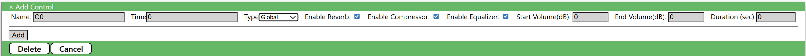
     
    <em>Global controls the impact room level functions of reverberation, compression, equalization, and volume</em>
  

  

    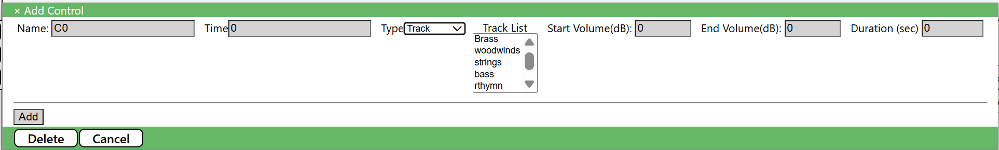
     
    <em>Track controls the impact track level setting of volume</em>
  

  

    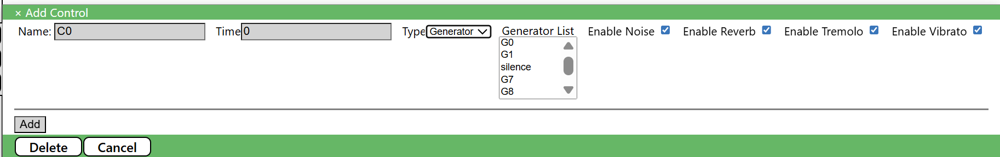
     
    <em>Generator controls the impact generator level settings of noise, reverberation, tremolo, and vibrato</em>
  

Controls can be modifed. This is discussed in the [Timeline](*timeline) section.

* **Edit Preferences:** CMG has preferences that apply both globally and to a CMG file specifically. When this option is selected, the following dialog window is displayed:
  

    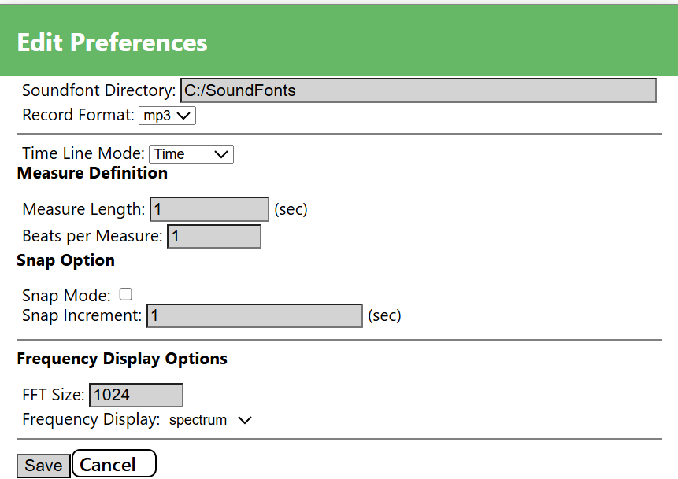
     
    <em>The dialog that changes global and composition preferences</em>
  

  The global preferences are:
  * **Soundfont Directory:** This tells CMG where the soundfont files are located in the computer's file system. Use the fully qualified path to the directory containing the soundfont files. When the preferences are saved, the soundfont directory list is loaded and a message is display indicating how many soundfont files are available. If none are located or the directory does not exist, an error message is displayed.
  * **Record Format:** Compositions may be recorded in either *WAV* or *MP3* format. Select the desired option. 

  The CMG file-specific options are save with the CMG file and are:
  * **Time Line Mode:** This is either *Time* or *Measure*. This setting may also be changed on the time line.
  * **Measure Length (sec):** This is the duration of a measure and must be greater than zero. 
  * **Beats per Measure:** This is the number of beats in a measure.
  * **Snap Mode:** Snap mode is used when moving generators. See [Moving a Generator Within Its Track](#moving-a-generator-within-its-track) for details.
  * **Snap Increment:** This is the snap resolution in either seconds or beats, depending on whether the time line is in *Time* or *Measure* display mode. 
  * **FFT Size:** While a composition is being previewed, the frequency amplitudes and volumes of the left and right channels are displayed. This parameter affects the resolution of the fast fourier transforamtion that is used to produce these results. It show be a multiple of 256. 
  * **Frequency Display:** The frequency amplitudes can be displayed as a spectra or as a sonogram. 

    
*Note: High FFT size and sonogram displays can have performace problems that effect the audio playback.

  When the *Save* button is pressed all preferences are updated. 

* **Edit Comment:** Each CMG file has a comments associated with it. By selecting the option, the comment may be modified through a popup window.

# Tracks
A track is displayed with a control section and a time section. 

  
   
  <em>The track control section with its various control and menu buttons</em>

The control section displays the name of the track and provides several track level functions:
<li><b><i>Delete:</i></b>  A track may be deleted by clicking this button. A track delete confirmation screen is displayed requesting confirmation of the deletion. </li>

* **Rename** - A track may be renamed as long as the new name is different from existing track names. The new name for the track must be different from all other existing tracks. If it is not, a message will be displayed at the bottom of the rename panel. The panel can be dismissed by clicking the x at the upper left hand corner of the panel.

* **Solo** - A track may be soloed when previewing or recording. All tracks that are soloed are played together and others are ignored. A track is taken in and out of solo each time the button is clicked. The track solo setting is ignored when a timeline interval is active. See the Section on the [Timeline Interval](#timeline-interval) for more details.

* **Mute** - a track may be muted when previewing or recording. A track is muted or un-muted each time the button is clicked. When a timeline interval is active, this setting is ignored.

* **Move Up** - When this button is clicked, the track is moved above the track immediately above it. The upper most track cannot be moved up.

* **Move Down** - When this button is clicked, the track is moved below the track immediately below it. The lowest most track cannot be moved down.

* **Tools** - By clicking this button, a menu is displayed with the following options. 
  **Duplicate** - A track with all of its generators may be duplicated. The new track will have a new name along with all of the generators with new names. The new track is placed at the end of the track list.
  **Shift** - All of the generators may be shifted in time either left or right. A popup will ask for the number of seconds to shift the track. A shift to the left must not cause any of the generators to start before zero seconds.
  **Volume** - The volume of all of the generators in the track may be raised or lower by a number of dB. This volume is added to the volume of the generator at each time volume is evaluated.
  **Exit** - The track menu removed from the display.

* **Add Generator** - When this button is clicked, a menu is displayed providing a list of generator type that can be added to the track. The initial name of the generator is unique to all generators in the file. See [Editing Generators](#editing-generators) for more details about adding and editing generators. 

# Time 

The basic time unit of CMG is the second. Time may be displayed and entered in measures and beats by defining the length of a measure in seconds and how many beats there are in a measure. The time line may be displayed in measures and generator times may be entered in measures and beats. This feature is available at the composition level and may not be changed in a composition. This is a very limited capability as measures and beats can change timing by time signature, ritards, and accelerations. In these cases, it is not recommended that the measure/beat feature be used. See details below in the time line and generator sections.

# Generators

Each generator is placed on a track at its start time and extends to its stop time. The name of a generator must be unique within the CMG file to which is belongs. A visual example of tracks and generators is shown in the example above.

In the example figure earlier are shown multiple tracks, each of which has one or more generators. All of the tracks, except the last, have been renamed and their names are unique. All of the generators are of the ***Algorithmic*** type.

## Editing Generators

Generators are the heart of CMG. There can be as many generators in a CMG file 
as is needed to produce the composition desired. There are four types of generators: one silent and three sound producers.

The ***Algorithmic*** and ***Stochastic*** generator types uses SoundFont presets. Each preset has a bank, channel number, and name. More information about SoundFont presets can be found in the [SynthFont[1] tutorial, part 6](https://www.synthfont.com/Tutorial6.html).

## Generator Types

### **Silent**
The silent generator contains the name of the generator, start time, and stop time. No sound is created by a silent generator. It can be used to offset the start of a composition or extend the ending to allow reverberation to die down.  

The figure below shows the panel for adding a new Silent generator. There is an **Add** Button. When a generator is modified, the button is displayed as **Modify**. Add and Modify functions may be canceled by clicking the ***x*** in the upper left-hand corner of the panel or by clicking the **Cancel** button.

  
   
  <em>The silent generator add/modify dialog</em>

The fields below are common to all generator types.
* **Name:** The name of the generator must be unique within all generators in the file. When a new generator is created the default name is a 'G' followed by a unique number. 
* **Start Time:** This is the time that the generator will start, in seconds, It must be greater than or equal to zero. When the start time is changed, the stop time is automatically changed to maintain the original duration.
* **Stop Time:** This is the time that the generator will stop. It must be greater than the *Start Time*.

When displaying time in measure form, the start and stop times are entered in measure and beat as illustrated below. This mode of time entry is not recommended when the time length of a measure or the number of beats in a measure varies

  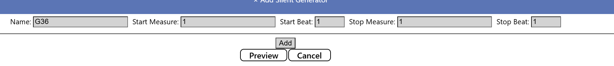
   
  <em>The silent generator add/modify dialog when in measure mode</em>

Each generator edit panel has a ***Preview*** button that can be used to preview the sound of the generator. In the case of a *Silent* generator, no sound will be produced.

### Algorithmic 
When the generator type of *Algorithmic* is added or one is edited, the Add/Edit panel for that type is displayed:

  
   
  <em>The algorithmic generator add dialog </em>

This figure illustrates the initial display when a new Algorithmic generator is being added. Note that the algorithm assigned to note, attack, speed, duration, volume, and pan is ***Constant*** and all values are set to defaults.
The fields and their restrictions are defined as follows: 

* **SoundFont File:** Each Algorithmic generator may have a different SoundFont file. SoundFont files contain sample-based synthesized sounds that are most frequently used by MIDI (Musical Instrument Digital Interface) devices. There are hundreds of SoundFont files existing today. A web site that contains quite a few is [Polyphone](https://www.polyphone.io/). CMG supports files with extent .sf2 and .SF2. The user places Soundfont files in a directory accessible by the application. More can be added as desired. It is selected from the list of those available using the selection pulldown. More information about SoundFont files can be found in [Wikipedia](https://en.wikipedia.org/wiki/SoundFont).
* **Preset:** This is a selection list that identifies which SoundFont preset in teh SoundFont file is to be used by the generator. No preset is available until the SoundFont file has been identified. The presets display their bank, channel number, and name. Only presets available within the SoundFont file can be selected. A SoundFont file and preset must have been selected before an Algorithmic generator can be added. A *Vew Preset* button is included to enable a view of teh preset based on the conditions of the generator. A lot of technical information is displayed which gives the information needed to define how the preset sound if modified based on its instruments, delay, attack, hold, sustain, and release profile.

  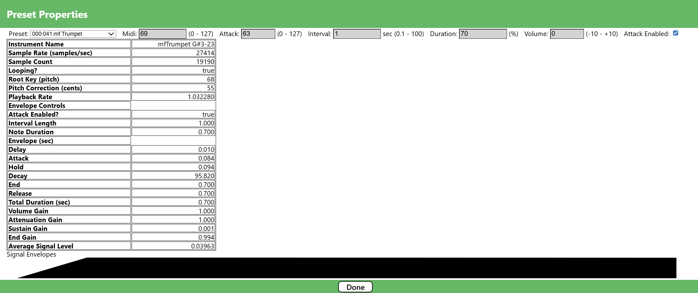
   
  <em>The view of a preset's properties using the <b>View Preset button</b></em>

* **Looping:** Instrument samples contain sounds that are produced for a certain amount of time. If the sound needs to be played for longer than the sample, then a sample loop is defined. This is part of the SoundFont protocol. This option allows the default behavior to be overridden such that no looping will be done. 
* **Attack Enabled:** SoundFont presets contain one or more instrument sounds. These instruments have delay, attack, hold, decay, and release profiles. The delay and attack potion of this profile can be disabled if the generated sound appears to be overemphasizes the attack.
* **Tools** This buttons causes a menu to be displayed that has the following options available:
  * **Frequency<->Midi** - This button provides a tool to convert between tone frequency and pitch number. 
* **Tremolo Definition:** Tremolo is defined as the change in volume of a sound. CMG uses a user-selectable wave form to produce the tremolo effect. By setting th speed or depth to zero, no tremolo affect is added.
  * **Tremolo Speed (mHz):** This is how fast the tremolo is varied. 
  * **Tremolo Depth (dB):** This is teh strength of the tremolo.
  * **Wave Form:** This allows the selection of one of several modulators for varying the tremolo effect.
* **Vibrato Definition:** Vibrato is defined as the change in pitch of a sound. CMG uses a user-selectable wave form to produce the vibrato effect. By setting th speed or depth to zero, no vibrato affect is added.
  * **Vibrato Speed (mHz):** This is how fast the tremolo is varied. 
  * **Vibrato Depth (dB):** This is teh strength of the tremolo.
  * **Wave Form:** This allows the selection of one of several modulators for varying the vibrato effect.

* **Noise Seed:** The is a character string that is used to seed the random number sequence for Gaussian noise. See the section on [random Numbers](#random-numbers)for more detail about seeds and random numbers.
* **Noise Frequency:** [Gaussian noise](https://en.wikipedia.org/wiki/Gaussian_noise) can be applied to the generated notes as frequency modulation noise. The noise frequency is added to the original note's frequency and then combined with the original signal. 
* **Noise Amplitude:** This is the gain of the noise. A value of 1 means the noise and the original note have the same volume. 
* **Reverb Duration:** The preset experiences reverberation that has duration and decay. This is the duration component, in seconds.
* **Reverb Decay:** This is the decay component of preset reverberation, in seconds. Both duration and decay must be nonzero to have reverberation applied.

* **Rhythm** - The beat of the sequence of notes (tones) is determined by a [Euclidean Rhythm](https://en.wikipedia.org/wiki/Euclidean_rhythm) algorithm. The beats that are silent will cause a note to be not heard on that beat. For example, a rhythm that has 4 beats in a measure with 3 of them on will produce a 3/4 rhythm with the first 3 'on' and the last one silent. This is particularly useful when applied to percussive voices, but can be applied to any voice. Rhythm is defined by the following fields:
  * **Measure Length:** The number of beats in a measure. This is an integer greater than zero.
  * **On Beats:** The number of non-silent beats in a measure. This number must be greater that zero and less than or equal to Measure Length.
  * **Beat Shift Amount:** The beat pattern generated by the Euclidean rhythm algorithm may be shifts left or right as desired.

* **Notes in Octave:** This is how many notes to be used within an octave. The actual notes are determined by a Euclidean Rhythm algorithm where the larger number is 12. For example, if the number of notes in an octave is 7, the notes selected are (0, 2, 3, 5, 7, 8, 10). If primary note is C, the notes to be used in the octave are C, D, D#(Eb), F, G, G#(Ab), and A#(Bb). When a note is generated by one of the algorithms described below, it is moved to the closed selectable note in the octave. If the notes in the octave are set to 12, then all notes are selectable. 

#### Sound Attributes

The values of the sound attributes can be determined by one of six algorithms. These algorithms are discussed below.
  * Note - This determines which pitch is to be used from the selected SoundFont preset. Sometimes call the midi number, a note may be fractional so that it lies between two integer pitch numbers. 
  * Attack - This defines the preset velocity representing how fast a key was pressed. Higher velocities cause instruments to be added to the preset that have rapid attack profiles. 
  * Speed - This determines the rate at which notes will be played. It is expressed in beats per minute (BPM). 
  * Duration - This is used to introduce a staccato effect to a note. Any value less that 100% will cause the note to be shortened during its performance period.
  * Volume - The volume of a selected note is expressed in decibels (dB) relative to the original sample level.
  * Pan - The sound of the note can be panned left (-1) and right (1). Zero (0) is the pan center.

Each of the attributes must have an algorithm assigned. The initial value is *Constant*, which assigns a single value to the attribute during its entire interval. The figure below shows an example of an Algorithmic generator that has different algorithms assigned to the attributes.

  
   
  <em>An algorithmic generator using a mixture of attribute algorithms. </em>

>>>
*Note: Pitch ranges from 0 to 127 and correspond to tones of C0 to G9 from the Acoustical Society at https://acousticalsociety.org/. When a pitch is entered, its name is displayed next to the entry box. Fractional numbers may be entered. For example is 60.5 is entered the note name is displayed as *C4+50*

The algorithm types are as follows:
* **Oscillator**  
  * **Modulator:** This is the type of oscillator used to modify the attribute over time. It can be either *Sine*, *Square*, *Triangle*, *Descending Sawtooth*, or *Ascending Sawtooth*. 
  * **Center:** This is the center value about which the attribute is oscillated. 
  * **Frequency:** This is the frequency of the oscillator expressed in *mHz*. The frequency must be between 0 and 1,000,000 in steps of 1.
  * **Amplitude:** This is amplitude of the oscillator in attribute units. For example if the note algorithm is Oscillator, the amplitude is 6, and the center number is 50, then the generated pitch numbers will vary from 44 to 56 over time. If the amplitude is 0, then the center value is generated at all times.
  * **Phase:** This is the phase of the FM oscillator expressed in *degrees*. The phase must be between -360 and 360 in steps of 1.
* **Markovian** 
  This generator creates a [Markov Chain](https://en.wikipedia.org/wiki/Markov_chain) the attribute using a three states with transition probabilities
  The states are  
    * keep the same value 
    * move the value up 
    * move the value down 

    Each sequence is bounded by a lower and upper limit and each move is done with a given step size. When an attribute hits an upper or lower limit, the value is reversed. For example, if pan is already at its upper limit (1 or right) and the suggested value is to move further up (right), the value is changed to move down (left). Thus, the containment walls are not 'sticky'.

  * **Seed:** This is a character string that is used to start the random number sequence for this generator. See [this](#random-numbers) for further discussion about random seeds.
  * **Start Value:** This is the value where the sequence of values for attribute starts. It must be between *Lo* and *Hi*.
  * **Lo:** This is the lowest value that can be assigned to the attribute. It must be smaller than the hi value.
  * **Hi:** This is the highest value that can be assigned to the attribute. It must be larger than the lo value.
  * **Step:** This is number to add or subtract from the current attribute to determine the next value when a state is changed. It must be less than or equal to the difference between *range hi* and *range lo*.

  The rest of the fields define state transition probabilities between the various states of the Markov Chain for the attribute. At any time, an attribute has a specific value. When it is time to obtain a new value, a transition from one state to the next is determined by drawing a random number. Each of the 9 transitions may have a different value but the sum of the three transitions out of a state and into another must sum up to one and each must be less than or equal to 1 and greater than or equal to 0. The figure below illustrates a example of the note attribute value will never stay at the same value and will have a probably of 0.5 of going either up or down.
  

    
     
    <em>An example of a markovian algorithm used for the speed attribute</em>
  

* **Wiener** This generator uses the [Wiener Process](https://en.wikipedia.org/wiki/Wiener_process) to create a random walk or Brownian motion of the attribute. It starts at some value and randomly walks with a trend and dispersion at each beat. A zero trend will keep the random walk centered around the initial value. A negative trend decrease the value over time, and a positive trend increases the value. The dispersion affects how far from the trend line the value will be. Dispersion increases over time.

  * **Seed:** This is a character string that is used to start the random number sequence for this generator. See [this](#random-numbers) for further discussion about random seeds.
  * **Initial Value:** This is the value where the sequence of values for attribute starts. It must be between *Lo* and *Hi*.
  * **Trend:** This is the rate at which the average value of the attribute walks away from the initial value. It is in 1/seconds. For example, if the trend is 1, then the average value of the attribute will increase by one each second. If the trend is zero average value is the initial values. Trend may be negative
  * **Dispersion:** This is the amount of dispersion in the random walk. It is in the rather strange units of 1/sqrt(seconds). If dispersion is zero, only a trend will occur. 
  * **Lo:** This is the lowest value that can be assigned to the attribute. It must be smaller than the hi value.
  * **Hi:** This is the highest value that can be assigned to the attribute. It must be larger than the lo value.

* **Autoregressive** This algorithm uses a first-order [Autoregressive Model](https://en.wikipedia.org/wiki/Autoregressive_model) to create a series of values with some persistence. The next value in the series is determined using weighting the previous value and adding a uniformly distributed random number.

  The autoregressive model has the following inputs:

  * **Seed:** This is a character string that is used to start the random number sequence for this generator. See [this](#random-numbers) for further discussion about random seeds.
  * **Initial Value:** This is the value where the sequence of values for attribute starts. It must be between *Lo* and *Hi*.
  * **Alpha:** The value of $\alpha$ in the formula above
  * **Dispersion:** This value of $\sigma$ in the formula above. 
  * **Lo:** This is the lowest value that can be assigned to the attribute. It must be smaller than the hi value.
  * **Hi:** This is the highest value that can be assigned to the attribute. It must be larger than the lo value.

  The values are restricted to the *lo-hi* interval.

* **Sequencer:** This algorithm uses a defined list of values in a sequence. Each value has a duration, given in beats. Sequences are stored in a CMG Sequence Database and are defined by the user through the CMG Sequence Editor application. See [CMG Database Editor](#cmg-database-editor). The length of time of a beat is determined by the *Measure Length* and *Beats per Measure* settings. 
  
Note: Sequences only apply to the note attribute.

  
  The sequencer has a five controls:

  * **Sequence Name:** This is the name of the desired sequence as it exists in the CMG Database for the selected attribute. When a sequence is selected for the note attribute the *Stop Time* will be changed to the sum of the *Start Time* and the sum of all of the beats in the selected sequence. The *Stop Time* can be subsequently changed if desired.
  * **Transposition:** This is an additive factor that changes the values of the sequence either up or down and is used primarily to change the key of a note sequence; however, it can be used to modify sequences assign to other attributes. Transposition may be positive, zero, or negative.
  * **Reverse Sequence?** A handy littel feature that reverses the sequence in time. The last value and beat is first and the first value and beat is last.
  * **Reflect Sequence?** Another handy feature that reflects the sequence about the **Reflect Pitch** value. For example if a note is 60 (C4) and the reflect pitch is 62 (D4), the resulting pitch is 64 (E4), which is the difference between C4 and D4 added to D4. Note reflect will keep the result note between 0 and 127.

### Stochastic 
In keeping with the strong influence that Iannis Xenakis has had on this work, a Stochastic generator is provided. This generator creates composition structures and sound cloud using stochastic first principles. A number of user controls are provided. The Stochastic generator uses the *Ensemble* portion of the CMG database to define voices that used by the stochastic the ensemble. The theory of stochastic music generation can be found in his book mentioned in the introduction. 

The stochastic generator dialog of a fully developed composition is shown in the following figure.

  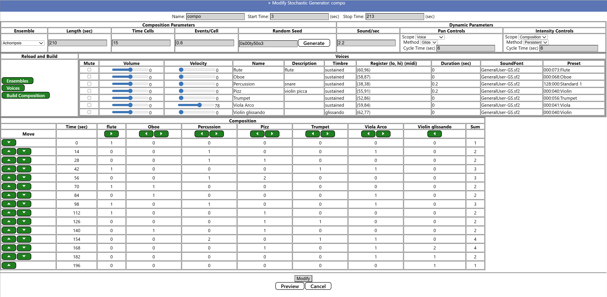
   
  <em>A fully realized stochastic generator</em>

A stochastic composition is a two dimensional matrix of cells. One dimension is time and the other is voice. The following figure illustrates the compositional structure of Xenakis' piece *Achorripsis*. Time is on axis and voice is the other vertical axis. Each entry in the matrix is called a 'cell'. The cells contain zero or more 'sound events' also called 'clouds'. 

  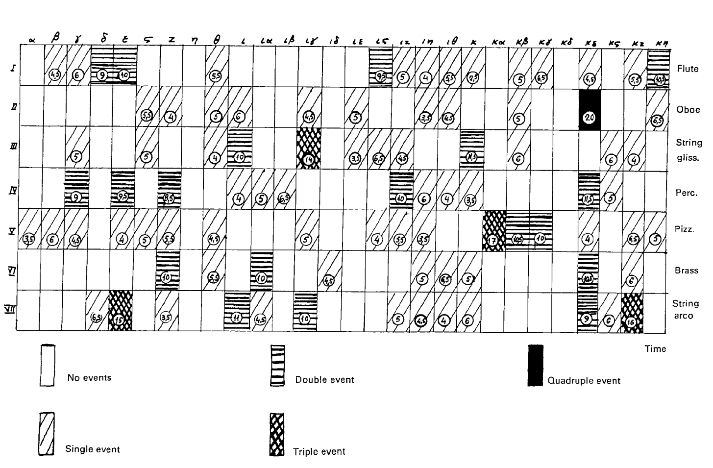
   
  <em>The composition matrix of Achorripsis</em>

The definition of this type of generator include composition parameters, dynamic parameters, ensemble voices, and the composition matrix. 
* **Composition Parameters:** These parameters effect how the composition is built. If any of them are changed, the current composition will be erased.
  * **Ensemble:** A stochastic generator must have an ensemble of voices to build upon. Ensembles are discussed further in the [CMG Database Edit](#cmg-database-editor) section of this document.
  * **Length (sec):** The total length in time of the composition. In actuality, the composition may be slightly longer while voices end after the final time interval.
  * **Time Cells:** Stochastic compositions are divided into time cells of equal length. The length of each cell is the total length of the composition divided by the number of time cells. For example, a composition that has a total length of 100 seconds divided into 20 cells will have cells that are 5 seconds long.
  * **Event/Cell:** This is the average number of events that are to occur during in each cell. An event is a 'sound cloud'. A sound cloud is a sequence of tones from a single source, e.g., a group of notes played by a trumpet.
  <note>
  * **Composition Seed:** This is a character string that is used to start the random number sequence for the composition of this generator. See [this](#random-numbers) for further discussion about random seeds.

* **Dynamics Parameters:** These parameters effect how the sound sources are built from the composition. Changes to them do not erase the current composition.
  * **Sounds/second:** This is the average number of sounds per second produced by each active voice in the ensemble. 
  * **Dynamics Seed:** This is a character string that is used to start the random number sequence for this generator. See [this](#random-numbers) for further discussion about random seeds.
  * **Pan Controls:** The spatial location of the sound can be moved from left to right using these controls.
    * **Scope** Pan can be applied to either all of the voices in the composition, to each voice individual, or to each sound cloud separately. If there is only one cloud in a composition cell, this is the same as voice application.
    * **Method** The pan method can be 'glide' or 'walk'. In the glide case, a random interval is selected and the pan changes from its current value to the next value, which is then used as the next current value. The glide time is a random number whose average is **Cycle Time (sec)**. In the 'walk' case, a random place from left to right is picked, and the pan changes to that pan through the **Cycle Time (sec)** value. All intervals for 'walk' are the same.
  * **Intensity Controls:** This controls the volume of the sound. Intensity variations occur by change the volume during the duration of the effect. For example, an intensity transition may be ppp>f>mf. There are 40 such transitions that CMG can pick from. 
    * **Scope** Intensity can be applied to either all of the voices in the composition, to each voice individual, or to each sound cloud separately. If there is only one cloud in a composition cell, this is the same as voice application.
    * **Method** The intensity method can be 'persistent' or 'random'. In the persistent case, a transition is selected at random from those available that had the same intensity (e.g., ppp - fff) as the previous transition. The transition duration time is a random number whose average is **Cycle Time (sec)**. In the 'random' case, a transition is selected at random from all of the possible transitions and the intensity changes to that through the **Cycle Time (sec)** value. All intervals for 'random' are the same.

* **Voices:** An ensemble is a collection of voices. Each voice has has characteristics which determine how it sounds in the composition. The details of a voice definition can be found in the section of [Ensembles](#ensembles) futher in this document. The fixed portion of a voice defintion includes a name, a description, timbre, register, duration, soundfont, and preset. Voices can be muted, which removes them from the sound generation but not the composition calculation. Each voice can have its volume and velocity adjusted. 

Voice mute, volume, and attack are dynamics parameteres which do not affect the composition structure. 

* **Reloading and Building:** During the construction of a composition, the user may wish to modify the ensemble using the CMG Database Editor. This might include adding, modifying, or removing ensembles, or modifying voice parameters. CMG does not know about these changes directly, so after changes are made, the use should select the ***Ensemble*** or **Voices** button as appropriate. Any change which affect the number of voices in the composition will result in a deletion of the current composition. 

The ***Build Composition** button will cause the composition to be rebuilt using teh current ensemble, length, time cells, events/cell, and compostion seed.

* ***Composition:*** The stochastic composition is displayed as a table with rows of time and columns of un-muted voices. The total number of events in a time row appear in the last column of the table. The numbers in each cell of the table are the number of events (clouds) for that combination of time and voice. 

The rows and columns can be rearranged by the user. Rows may be moved up and down the table, and columns may be moved left and right. This provides some creativity to the composition, giving control of dynamic progression and voice prominence. The order of the rows and columns are maintained through the life of the composition and is saved with the CMG file. If any compositional parameters are changed the composition is erased and all previous reorder is forgotten.
 
### AudioFile.
This is not really a generator as it will play a saved audio file rather than generate a new sound. The user specifies the start time of the playback and its volume. The entire audio file is then played from beginning to end. A good use of an audio file generator is to build up a new composition from the recording of other compositions.  
- **Volume:** This is the volume at which the audio file will be played back. It must be between -10 and 10 with a step size of 1. The default value is 0.
- **Audio File:** All files are displayed and the one selected will be read. If it is not an valid audio file, at error message will be display and the file will not be loaded. The stop time an the information about the audio file (sample rate, duration, and number of channels) is not updated until the volume is changed or the next time the generator is viewed.

  
   
  <em>The definition of an audiofile generator </em>

## Generator Pulldown Menu

Each generator has a pulldown menu that is activated by clicking on the name of the generator in the track timeline display. The following functions are available:

* **Preview** - The sound created by the generator may be previewed on its own without hearing any other generators. The sound will start as if the generator had been defined to start a time 0 (the start of the composition). See [Preview](#Previewing) for more details.
* **Edit** - A entry panel is displayed containing all of the values of the fields for the generator. All fields can be modified. If the *Delete* button is clicked a confirmation panel will be displayed before the deletion occurs:
* **Copy** - A panel is displayed providing the means to copy the selected generator to any of the existing tracks. The default is the track where the generator currently lies. A new generator is created with all of the same values as the selected generator, except a unique name is assigned to it. The panel may be exited by either clicking *Cancel* or the *x* in the upper left hand corner of the panel. 
* **Move** - A panel is displayed providing the means to move the selected generator to any of the existing tracks. The default is the track where the generator currently lies. The panel may be exited by either clicking *Cancel* or the *x* in the upper left hand corner of the panel.
* **Mute/Un-mute** - A generator may be muted or un-muted. This affects whether or not it will be heard during Preview or Record. When a generator is muted, its name and type in the track is displayed in red. 
* **Exit** - The generator pulldown menu is hidden.

## Moving a Generator Within Its Track
### Vertical Movement
Each generator is displayed as an icon with its length determined by its start and stop time and the current timeline settings. Its height is 1/3 of the height of the track timeline display. A generator icon may overlap other icons on the timeline display so it may be desirable to move it away from the others. A generator may be moved vertically up or down by clicking anywhere in the icon except the title and dragging the mouse up or down. When the mouse is released, the icon assumes its new position. This position is part of the generator's properties and is saved in the CMG file.
### Horizontal Movement
By click/drag either end of the generator icon, the timing of the generator can be moved. This will change the start or stop time.  

# Timeline

## Timeline Control
The Timeline is a window into the time frame of the full composition. It can be scrolled and zoomed as desired to best display the generator icons as a composition be being constructed. The figure below is an example of a timeline with the controls display on the left side and the time scale shown to the right. 

  
   
  <em>The CMG time line</em>

The following buttons are available to control the time line display:

* **Scroll** - The timeline can be scrolled either left or right by clicking the left arrow or right arrow buttons in the timeline control area. The timeline cannot be scrolled left further than time zero and right further than several years.
* **Zoom** - The timeline can be zoomed in or out to reveal more or less detail by clicking the zoom in or zoom out buttons. The zoom function has both maximum and minimum zoom levels. Each zoom roughly doubles or halves the resolution of the timeline. The time values and tick marks are displayed appropriately to the zoom level in hours, minutes, and seconds.
* **Time/Measure** - This button switches the timeline display between time and measure modes. 

The scroll and zoom functions of the timeline control how the generator icons are seen. Each generator has a start and stop time which may or may not be with the currently displayed timeline. Only part or none of the generator icon may be seen at any particular timeline setting.  

## Timeline Interval
This if one of the filters for previewing and recording is the timeline interval. This filter defines which generators are selected and overrides the other filters of muting or soloing of tracks and generators. A timeline interval has a start and end time. Generator whose start and stop time fall with the timeline interval are selected. 

A timeline interval is defined by mouse actions within the timeline. When the mouse moves into the timeline, the cursor changes to an *crosshair* cursor indicating that an interval can be defined. If there is a interval defined, the cursor will change either to a *grab* cursor or a *ew-resize* cursor depending on whether the mouse of within an displayed interval or on one of its edges.

This figure illustrates a typical timeline interval with three selected generators.

  
   
  <em>The definition of a time interval and its effect on generator selection</em>

- **Defining a timeline interval** This is initiated when a *crosshair* cursor is displayed. Clicking the mouse button and dragging either left or right will define a new interval. When the mouse button the interval is defined. A defined timeline may be removed by clicking and releasing anywhere on the timeline except within the existing timeline.
- **Moving the timeline interval** When the mouse is within the interval and the 'grab' icon is display. A left mouse click with a drag left or right will move the interval. Once the mouse is released the new position is finalized and the generators contained within it are highlighted.
- **Moving the start or end of the timeline interval** When the mouse is moved over either the start or end of the timeline interval, an *ew-resize* cursor is displayed. A left mouse click with a drag left or right will move the selected end of the interval. Once the mouse is released the new end point is finalized and the generators contained within the interval are highlighted.

## Sound Controls

Controls, as discussion in the [Edit Menu](#edit-menu) section above, are display as carats on the time line. By clicking the carat, the user can modify the definition of the control or delete it.

# Room Level Functions
During the rendering of a generated sound composition, all of the sources from all of the active generators are pulled together to allow for the room level audio modulators of volume, reverberation, compression, and equalization to be applied. These modulators are applied to all of the sound sources as an aggregate. mimicing the effect of a performance environment (reverberation) and the roll of a sound engineer for a performance (compression, equalization, and volume). The parameters of the room level functions are part of the composition definition and are saved so they can be loaded later. The room level controls are located in the right hand corner of the screen. Their values are set by the use of sliders. Reverberation, compression, and equalization may be disabled.

  
   
  <em>The room level controls</em>

These effects are part of the CMG composition. There settings are saved in the CMG file. The values may be changed during composition definition or during preview.

## Room Reverb

Room reverb a two types of controls: diffuse sound sliders and early reflections sliders. 

The diffuse sound generates a reverb effect that occurs for a certain duration (0 to 10 seconds) and linear decay time (0 to 10 seconds).

There are three early reflection effects, simulating a left wall (LW), a right wall (RW) and a ceiling. Each has a single delay of the sound of a specified number of milliseconds (0 to 1000) with a certain signal left relative to the original sound (0 to 1).

The Room Reverb may be reset to default by clicking the room reverb reset button. It can also be enabled or disabled.

## Room Compressor 

The compressor is a [DynamicsCompressorNode](https://developer.mozilla.org/en-US/./Web/API/DynamicsCompressorNode). 
There are five controls to the compressor:
- **Threshold** The decibel (dB) level where the compressor will start taking effect. The threshold default is -24dB and has a range of -100dB to 0dB. 
- **Knee** The dB level representing the range above the threshold where the curve smoothly transitions to the compressed portion. The default value is 30dB and the range is 0dB to 40dB.
- **Ratio** The change, in dB, needed in the input for a 1 dB change in the output. The default value is 12 and the range is 1 to 20.
- **Attack** The time, in seconds, required to reduce the gain by 10 dB. The default value is 3 ms and the range is 0 ms to 1,000 ms.
- **Release** The time, in seconds, required to increase the gain by 10 dB. The default value is 250 ms and the range is 0 ms to 1,000 ms.

The amount of *reduction*, in dB, currently being applied to the signal appears in the compressor title line during preview.

The compressor values may be reset to defaults by clicking the compressor reset button. It can also be enabled and disabled.

## Room Equalizer
The equalizer has 10 frequency band filters, roughly spaced 1 octave apart. The lowest band is a *lowshelf* filter. The highest band is a *highshelf* filter, and the remaining 8 are *peaking filters*. The *Q* value for the peaking filters is defined as the ratio between the frequency of the filter and the next higher filter, which is roughly 2. 

The frequencies of the equalizer are not adjustable, but the gains are. They may be varied from -10 to +10 dB by moving the gain slider. The default values for all filter gains is 0, which can be restored by clicking the equalizer reset button.

The equalizer values may be reset to defaults by clicking the equalizer reset button. It can also be enabled and disabled.

## Room Volume
The volume slider affects the final volume of the generated sound. The slider has a default value of 0. It ranges from -10 dB to +10 dB in steps of 1. Positive values increase the volume, while negative values decrease the volume. 

# Previewing, Recording, and Reporting
The whole purpose of this application is to produce sound from the defined generators. This is accomplished using the Preview and Record menu options on the *Play* menu. A *Report* option is also available. 

*Note: When in preview mode a Preview window is displayed, which disables all composition function except the room reverb, compressor, equalizer, and volume until the preview is stopped or completed. When in record mode, a popup appears to show the progress of the recording. Preview and recording may be stopped prematurely if desired. 
 

Generator selection occurs by evaluating some filters:
- **Timeline Interval** If a timeline interval is defined, only the generators that are selected by the timeline will be previewed or recorded. The time of the preview or record is started at the start time of the earliest selected generator.
- **Active Generators** Tracks may be soloed or muted and generators may be muted. All of the tracks and generators are checked for these conditions. If a track is both muted and soloed, solo takes precedence. 

If there are no generators that pass these tests a popup is displayed and no preview or recording will be performed.

## Recording

When the *Record* button is clicked, you will be prompted to provide a file name and location where the result audio file will be placed. The audio file may be either a WAV or a MP3 file depending on the selected preference. Once that has been identified, the selected generators are rendered and the wave file is written. 

A progress bar is displayed while the recording is being constructed. 

## Previewing

When the *Preview* button is clicked, a preview window is displayed so that the sound sources produced by the selected generators can be seen. Below is an example of a preview window when *Preview* is first selected.

  
   
  <em>Previewing a CMG composition</em>

This window has three sections:

- Header: The application logo, a set of buttons, the application name, version, and file, the left and right volume monitors, and the time line are displayed here. The initial set of buttons are ***Exit*** and ***Start***. Exit will terminate the preview and return to either the main composition panel or the generator dialog, depending on how Preview was invoked. When Start is pressed, it is replaced by a ***Pause*** button. Pressing the Pause button will cause it to be replaced by a ***Resume*** button. Pressing the Resume button will resume the preview and display the Pause button again.
- Body: Up to three sections may appears in the body - Instruments, Percussions, and AudioFile/Stochastic. Each section's scale is derived from the range of values that the notes of the sources can take. The lower left hand corner display the section name and the minimum value on the scale, while the upper left hand corner displays the maximum value of the scale. In the case of the percussion section, the notes each correspond to a different percussion instrument as per Soundfont2 rules. The instrument and percussion sections also have dashed lines that represent the integer pitch numbers. A bolder dashed line indicates a C note.
  
  Within each section the sources are displayed. The vertical location corresponds to its note value, while its horizontal extent is determined by its start time and duration. The color is such that the hue is based on the pan location, the saturation is based on its volume, and its lightness is based on whether or not it is current producing sound. See the figure below for a close up of a preview that has been paused with some sources currently producing sound. 

  
   
  <em>An enlarger picture of the preview window</em>

    If a generator is previewed by selection of generator preview option, or generators are selected via the timeline interval, the generators' start times are moved such that the earliest start time is at zero. This avoids waiting until the generator would normal start before it is heard.

    When previewing, the current time of the soundtrack is shown by a moving red vertical line on the timeline. This line advances are time progresses. The time line pans right to maintain the current time in the window.
- Footer: The number of total and active sources and generators are displayed in the footer along with the left and right channel spectra and volume levels, and the room sound controls. Any of the room sound controls may be modified during preview in order to hear their effect.

## Reporting
A report of the composition can be produced using the **Report...** button of the **Play** menu. This report, in HTML format, provides the specific details of the file, all of its tracks, and all of its generators. The sources produced by each generator is expanded. This detail is provided for each generator, and then for all generators in start time sequence. 

# Intensity Transitions

The stochastic generator has the ability to select a intensity transition form and apply it to the sound either at the composition, voice, or cloud level. The following is the list of transitions available in CMG. If *middle* is present, CMG changes the intensity from the *start* to the *middle* at the mid point of the duration and then to the *end*. If *middle* if missing, CMG goes directly from start to end during the duration.

| Start | Middle | End |
|----|----|----|
| ppp||ppp |
| ppp||p |
| ppp | p|ppp |
| ppp||f |
| ppp | f|ppp |
| ppp||ff |
| ppp | ff|ppp |
| ppp | f|p |
| ppp | ff|p |
| p||ppp |
| p | f|ppp |
| p | ppp|f |
| p | ppp|ff |
| p | ff|ppp |
| p||p |
| p | ppp|p |
| p||f |
| p | f|p |
| p||ff |
| p | ff|p |
| p | ff|f |
| f||ppp |
| f | ppp|p |
| f||p |
| f | ppp|ff |
| f | ff|ppp |
| f | p|ff |
| f | ff|p |
| f||f |
| f | ppp|f |
| f | p|f |
| f | ff|f |
| f||ff |
| ff||ppp |
| ff | ppp|p |
| ff | ppp|f |
| ff | p|f |
| ff|f |
| ff||ff |
| ff | ppp|ff |
| ff | p|ff |
| ff | f|ff |

# CMG Database Editor

The CMG Database Editor is used to create, modify, and delete sequences and ensembles used by CMG. The primary CMG Database Editor Window appears when the application is started.

  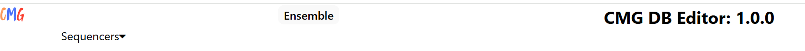
   
  <em>The main options of the CMG database editor</em>

Sequences and ensembles may be edited. 

## Sequence Editing

Sequences may be defined for any of the tone attributes, which are note, speed, attack, duration, volume, and pan. A sequence has one or more entries. Each entry has a value and a beat count. The value is in the units of the attribute, i.e, notes are pitch number, speed is in beats per minute, and so on. The beat count is any number greater than zero and represents the number of beats that the value should be applied. When CMG uses a sequence, it starts with the first entry, holds that value for the number of beats, and then goes to the next entry. 

Note: CMG only uses note sequences. Other sequence types (attack, etc.) can be created but currently are not used.

The conversion of beats to time is done by CMG using the *Measure Length* and *Beats per Measure* values of the composition. See [Sequencer](#sequencer) algorithm for further explanation of how sequences are processed. 

Sequences may be tagged so that they can be organized and searched. Tags must exist before they can be used by sequences. A sequence may have zero or more tags.

## Tags 

The list of tags appear on the right hand side of the editor window. 

  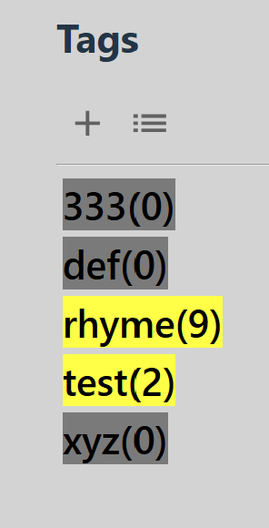
   
  <em>The CMG editor tags</em>

This list is displayed when a sequence attribute has been selected. 
New tags may be added by presses the plus icon. New tags may have any number of characters greater than zero.

The tags list entries contain the name of the tag and the sequences of the current attribute that are currently assigned to the tag. This is not the number of all of the sequences assigned to the tag. 

Tags are displayed with three different background colors:
* **Yellow** - The current attribute has sequences that are using the tag. By clicking the tag name, the list of those sequences is displayed in a list. By clicking an entry in this sequence list, the sequencer may be edited. 
* **Gray** - The tag is not used by the current attribute but is used by others. No action is performed if the tag name is clicked.
* **Red** - The tag is not used by any sequence of any attribute. Clicking the tag name will ask for a confirmation to delete the tag.

## Sequences

By clicking one of the attribute buttons in the application header, the list of current sequences for that attributes is displayed along with the list of tags. An example of a list of Note sequences is shown here:

  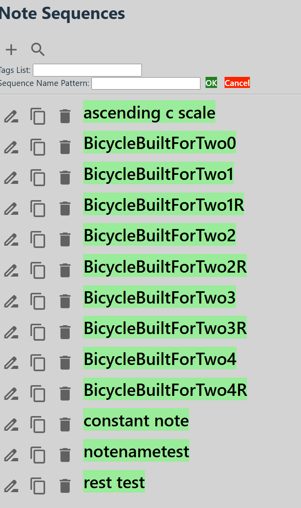
   
  <em>A list of note sequences</em>

Sequences may be added by clicking the plus icon. Adding sequences is discussed further below. Sequences may be searched by clicking the magnifying glass icon. When this is clicked two search fields are display that provide for searching by tag and/or sequence name. Multiple tags may be provided by delimiting them with a comma. The name field may contain wild cards. For example to find a sequences that start with the letter *Q*, enter Q* in the name field. When *OK* is clicked, the list of tags matching the search is displayed. A sequence may be edited by clicking its name. 

* **Adding and Editing** - 
Sequences are edited by either adding a new one, or clicking on a sequence name in either the sequence list, sequence search list, or tag sequence list. 

  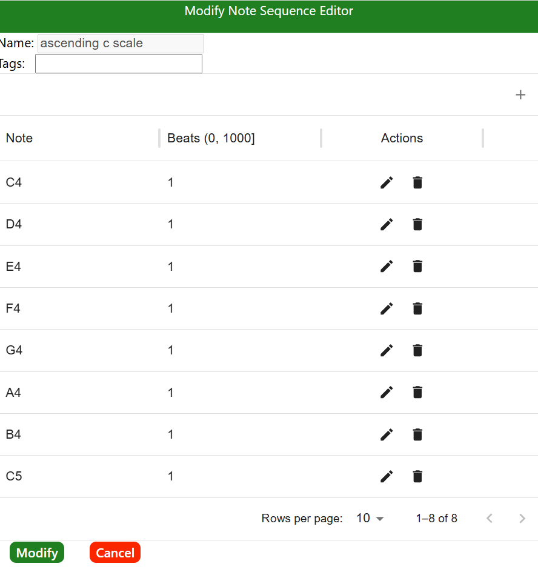
   
  <em>the sequence edit dialog</em>

When a sequence is added, the *Name* field is blank and must be provided. The sequence name must be one or more characters long and be unique within the attribute. Two different attributes may have sequences with the same name. 

Zero or more tags may be assigned to the sequence. Provide a list of tags by separating them with commas. If tags are assigned, they must already exist within the list of tags.

The business end of the CMG Sequence Editor is the list of sequence items. Each item has a value and a beat count. A new item is added to end of the list by clicking the plus icon. When a new item is added, it is in edit mode, which display a *Save* icon on the right side. Any item may be edited by pressing the *Pencil* icon. 

The item value is in the units of the attribute. The beat count can be any number greater than zero. In the case of the note attribute, values are entered in pitch notation. This is a note name (A-G, a-g) followed by a single digit octave number (0-9), followed by an optional accidental character (# or b), followed by a optional number of positive or negative cents (-99 through +99). The note name will be capitalized when stored in the database.

An item may be deleted by clicking the trash can icon. A popup will be displayed requesting confirmation of the deletion.

All item editing must be completed before the sequence can be modified or added. The is done my clicking the *Add/Modify* button once it is enabled. All items are checked that they are valid and all tags are checked that they exist before the sequence is added or modified. Sequence editing can be canceled by clicking the *Cancel* button.

* **Renaming** 
A sequence may be renamed by clicking the *Pencil* icon left of the name in the sequence list. A popup is displayed requesting the new name. This name must be unique within the attribute. 

* **Duplicating**
A sequence may be duplicated by clicking the *Duplicate* button left of the name in the sequence list. A popup is displayed requested the new name of the sequence and to which attribute it should be duplicated. The name must be unique within the attribute.  

* **Deleting**
A sequence may be deleted by clicking the *Trash Can* button left of the name in the sequence list. A popup is display requested confirmation of the deletion.

## Ensembles
Ensembles are used by CMG to define the voices to be used in a stochastic generator. Each ensemble has a name, a description, and a list of voices in the ensemble. Voices have parameters that determine how it will sound in the ensemble.

The main dialog for this function includes a list of ensembles and voices. 

  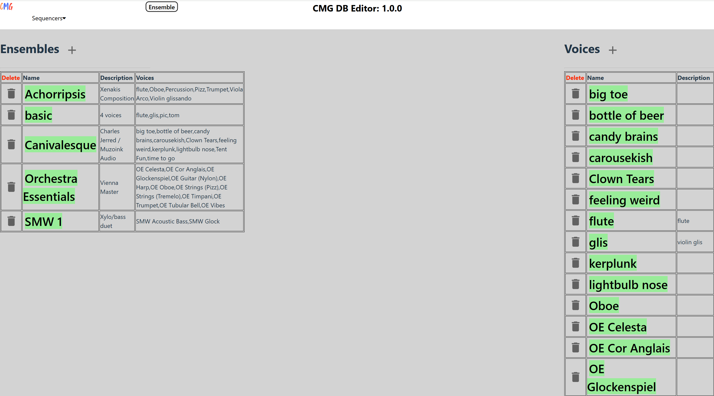
   
  <em>A list of ensembles and voices in the CMG Database</em>

### Voice Maintenance
Voices may be added by clicking the *+* button, deleted by pressing the garbage can button, or modified by clicking the name of the voice. Below is an example of modifying an existing voice:

  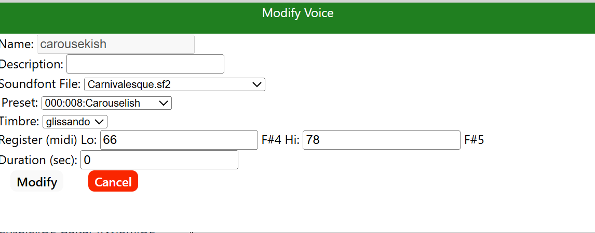
   
  <em>Modifying a CMG voice</em>

Each voice has the following values:

* **Name:** A unique name for the voice. This must be provided when adding a voice and connot be changed when modifying a voice.
* **Descripion:** An optional description of the voice
* **Soundfont File:** A list of soundfonts available to CMG is provided for selection. 
* **Preset:** Once a soundfont file is identified, a list of presets available is provided for selection. 
* **Timbre:** A voice may be either *sustained* or *glissando*. Sustained voices hold the same pitch for the duration of the note, while glissando voices slide from one pitch to the next. 
* **Register:** This is the lowest and highest pitch that the voice can play. It is given in *midi* units with the notation shown following the input field. In the case of percussion voices, this selects the type of percussive instrument. 
* **Duration:** The duration of sustain voices are normally the full interval of the note. Setting duration to a nonzero value, cuts the duration down to the value provided. For example, a duration of 0 for a viol will produce a viol arco sound, A non zero value will produce a viol pizzacato sound. 

### Ensemble Maintenance 
Ensembles have a name, a descrition and a list of included voices. Ensembles may be added (click the *+* button), deleted (click the trash can button), or modified (click the ensemble name). When a ensemble is added or modified the following dialog is displayed:

  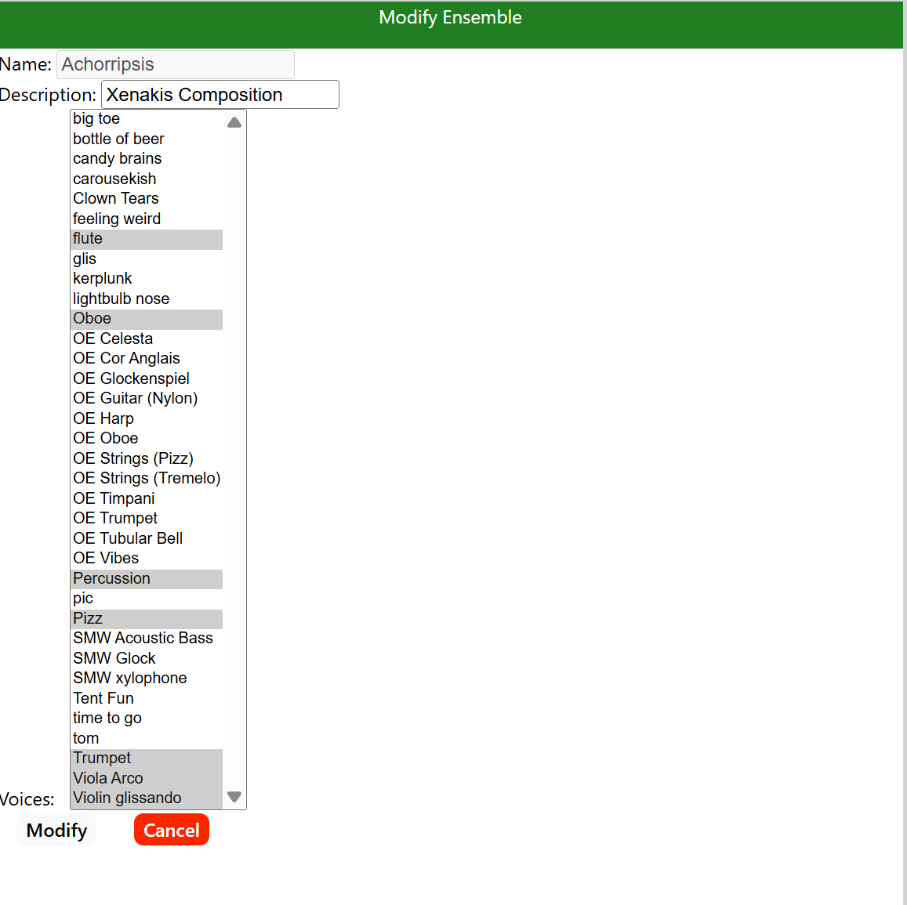
   
  <em>Caption text</em>

An ensemble has the following values:

* **Name:** A unique name for the ensemble. It must be present when added an ensemble and cannot be changed when modifying an existing one.
* **Description:** An option description of the ensemble
* **Voice:** A selection list of available voices. Multiple voices may be selected from this list.

# Random Numbers
 Random numbers are used by in several places in CMG. CMG is implemented in Javascript, which has no means to initialize a random number sequence with a seed. See [this](https://stackoverflow.com/questions/16801687/javascript-random-ordering-with-seed) for a good discussion on generating random numbers. There are three options to set the random number seed. 
 * Blank - If the seed is left blank, the current date and time will be used to initialize the random number generator. This will cause the resulting sound generator to be different each time the composition is previewed or recorded.
 * User-entered value - The user may entered a specific string for the seed. This is partocularly useful when it is desired that different attributes follow the same sequence of random numbers. For example, Wiener series applied to two differrent generators with the same seed, will change the notes in the same way, thus maintaining the same initial pitch spacing through the generators' lives. 
 * New Seed - a button is provided to allow CMG to generator a new seed. After it has been generated, it bahaves like a user-entered value.
# Glossary
The definition of many of the terms used in this manual can be found online, particularly at [Wikipedia](https://en.wikipedia.org/wiki/SoundFont). 
| Term | Meaning |
| ----------- | ----------- |
| SoundFont File | SoundFont files contain sample-based synthesize sounds that are most frequently used by MIDI (Musical Instrument Digital Interface) devices. More information about SoundFont files can be found in [Wikipedia](https://en.wikipedia.org/wiki/SoundFont). |
| MIDI Number | Musical Instrument Digital Interface (MIDI) continuous control number (CCN). A values used to select which sample from a preset is to be used by a generator.  |
| Preset | A SoundFont preset is a collection of instrument samples that are used to make up the a sound. Presets are identified by a bank number, a channel number, and a name. CMG only uses the first instrument in a preset collection of instruments to produce sound. |
| Markov Chain | This may be used by the Algorithmic generator for one or more attributes and is best described by [Wikipedia](#https://en.wikipedia.org/wiki/Markov_chain) |
| Sound Compression | Audio Dynamic Range Compression, not to be confused with Data Compression is best described in [Wikipedia](#https://en.wikipedia.org/wiki/Dynamic_range_compression) |
| Sound Equalization | This is best described by [Wikipedia](#https://en.wikipedia.org/wiki/Equalization_(audio))  |
| Low Shelf filter | This is best described by [Wikipedia](#https://en.wikipedia.org/wiki/Filter_design) |
| Peaking Filter | This is a band-pass filter as defined by [Wikipedia](#https://en.wikipedia.org/wiki/Band-pass_filter)  |
| High Shelf Filter | This is best described by [Wikipedia](#https://en.wikipedia.org/wiki/Filter_design) |
| Q Value | This is parameter os a band-pass filter as defined by [Wikipedia](#https://en.wikipedia.org/wiki/Band-pass_filter) |
| Weiner Series | This is used by the Algorithmic generator to determine values for one or more of the attributes. The series is described in [Wikipedia](https://en.wikipedia.org/wiki/Wiener_series). |
| Euclidean Rhythm | This is used by the Algorithm generator to create [Euclidean Rhythm](https://en.wikipedia.org/wiki/Euclidean_rhythm) patterns and to select notes from the 12-note scale. |
