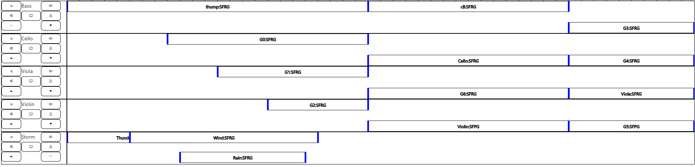
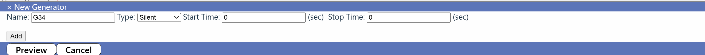
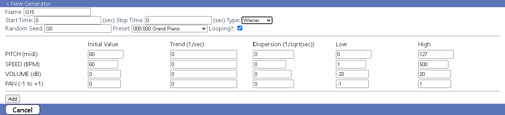
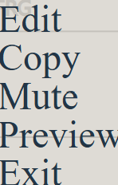

**Table of Contents**
- [Introduction](#Introduction)
- [Handling CMG Files](#HandlingCMGFiles)
  - [Creating a New CMG File](#CreatingaNewCMGFile)
  - [Saving a CMG File](#SavingaCMGFile)
  - [Opening a CMG File](#OpeningaCMGFile)
- [Selecting a SoundFont File](#SelectingaSoundFontFile)
- [Editing Tracks](#EditingTracks)
  - [Tracks and Generators](#TracksandGenerators)
  - [Adding and Modifying Generators](#AddingandModifyingGenerators)
- [Editing Generators](#EditingGenerators)
  - [Generator Types](#GeneratorTypes)
  - [Generator Pulldown Menu](#GeneratorPulldownMenu)
  - [Moving a Generator Within Its Track](#MovingaGeneratorWithinItsTrack)
- [Handling the Timeline](#HandlingtheTimeline)
  - [Timeline Interval](#TimelineInterval)
- [Room Level Functions](#RoomLevelFunctions)
  - [Room Volume](#RoomVolume)
  - [Room Compressor](#RoomCompressor)
  - [Room Equalizer](#RoomEqualizer)
- [Previewing and Recording](#PreviewingandRecording)
  - [Recording](#Recording)
  - [Previewing](#Previewing)
  - [Preview Marker](#PreviewMarker)
- [Glossary](#Glossary)

# Introduction

The Computer Music Generator (CMG) application was inspired by the book [Formalized Music: Thought and Mathematics in Composition](https://en.wikipedia.org/wiki/Formalized_Music), by Iannis Xenakis, which I read many years ago and am just getting around to implementing something. Some of the features that Xenakis' lays out along with other concepts are included. CMG will be enhanced as I locate other computer music generation concepts, most notably the use of the Euclidean algorithm to implement rhythm.

The features of the CMG include:
- Retention of defined sound generation files between working sessions,
- The use of SoundFont files to produce Midi sounds,
- The separation of sound generator into tracks that mimics the parts in a music score,
- Two types of sound generators,
- Room level sound volume, compression, and equalization controls, and
- Previewing and recording of assembled compositions.

An example of a composition in progress is shown here:

The layout of the screen includes a header section, a body section, and a footer section. 
* The header provides 
    * the name of the application, the name of the file currently being displayed, and a comment button useful for adding comments to the composition,
    * buttons for handling the composition file and tracks,
    * a SoundFont file selector, and Record and Preview buttons, and
    * time line controls and the timeline.

* The body provides the display and control of composition tracks and generators.
* The footter has a status message display area, and controls for room level volume, compression, and equalization. 

Each of these are explained further in the upcoming sections. 

# Handling CMG Files 

CMG files are handled by the File Menu Items:

## Creating a New CMG File

When CMG starts, it has is ready to define a new composition file, no identified SoundFont file, default room volume, compressor, and equalizer settings, and no tracks or generators. At any time, the menu item ***New File*** can be selected to clear the existing workspace. If changes have been made to the workspace since the last save, you will prompted to confirm that you want to delete these changes without saving: 

> 
*Note: The CMG screen header shows the name of the file currently being edited. If changes have been made since the last save, an asterisk (*) will follow the file name.
 

## Saving a CMG File

CMG files are created by accessing the menu item ***Save File...*** or by pressing **ctrl-s** on the keyboard. Files may be placed anywhere that they can be accessed within the file system. Files are saved with a ***.cmg*** extent. If the file already exists, you will be prompted to agree with overwriting the existing file. This saves the name of the SoundFont file, the room compressor settings, room equalizer settings, and all of the tracks and generators defined. 

> 
*Note: Long projects contain a lot of data and take some time to create. Ensure the file is fully saved before existing CMG or shutting done the computer.  The Status Bar at the bottom shows a message when the file has been saved.

## Opening a CMG File

CMG files are opened by clicking the menu item ***Open File...*** button or by pressing **ctrl-o** on the keyboard. Files with the extent of ***.cmg*** are displayed and the one selected will be read. This includes all of the items that were saved (SoundFont file, room compressor setting, room equalizer settings, room volume setting, and all tracks and generators). If the file is not in proper format, a status message will be displayed and the file will not be opened.

# Selecting a SoundFont File

The CMG application has a library of available SoundFont files that are used by the Algorithmic the sound generator. SoundFont files contain sample-based synthesized sounds that are most frequently used by MIDI (Musical Instrument Digital Interface) devices. There are hundreds of SoundFont files existing today. This application has a small collection of them available. More can be added as desired. 

One SoundFont file can be selected for use by a CMG composition. It is selected from the list of those available using the selection pulldown:

*Note: Changing from one SoundFont file to another is allowed but may have an undesirable side effect. If there are generators existing that are using presets from the current SoundFont file, these will be remapped to those in the new SoundFont file using the bank and channel number of the preset (not the name). If none exists in the new file, the first preset is assigned and a warning message displayed.
 

More information about SoundFont files can be found in [Wikipedia](https://en.wikipedia.org/wiki/SoundFont).

# Editing Tracks

The computer generated piece of music is constructed by defining tracks and placing generators along them at various start time and end times. By clicking the menu item ***New Track*** button a new track is added to the end of the list of existing tracks.

The new track is given a unique name that starts with ***T*** and ends with a number which is unique from all other existing tracks. The track is displayed with a control section on the left side and a timeline display on the right.

The control section displays the name of the track and provides several track level functions:
* **Delete**: A track may be deleted by clicking this button. A track delete confirmation screen is displayed requesting confirmation of the deletion. 

  

* **Rename**: A track may be renamed as long as the new name is different from existing track names. 

  

  The new name for the track must be different from all other existing tracks. If it is not, a message will be displayed at the bottom of the rename panel. The panel can be dismissed by clicking the x at the upper left hand corner of the panel.

* **Solo**: A track may be soloed when previewing or recording. All tracks that are soloed are played together and others are ignored. A track is taken in and out of solo each time the button is clicked. The track solo setting is ignored when a timeline interval is active. See the Section on the [Timeline Interval](#timelineinterval) for more details.

* **Mute**: a track may be muted when previewing or recording. A track is muted or un-muted each time the button is clicked. When a timeline interval is active, this setting is ignored.

* **Move Up**: When this button is clicked, the track is moved above the track immediately above it. The upper most track cannot be moved up.

* **Move Down**: When this button is clicked, the track is moved below the track immediately below it. The lowest most track cannot be moved down.

* **Add Generator**: When this button is clicked, a dialog pane is opened to add a new generator to the track. The initial name of the generator is unique to all generators in the file. See the section below for more details about adding and editing generators.

# Editing Generators

Generators are the heart of CMG. There can be as many generators in a CMG file 
as is needed to produce the composition desired. There are three types of generators: one place holder and two sound producers.

One of the generators use a SoundFont presets. Each preset has a bank, channel number, and name. More information about SoundFont presets can be found [here](https://www.synthfont.com/Tutorial6.html).

## Generator Types

1. Computer Music Generator (**CMG**). This generator does not produce any sound.
Its role is a placeholder on the timeline. It is used by the other generators to define the generators name, and the time that the sound generator start and stops. 
2. Algorithmic (**Algorithmic**). This generator uses various algorithms to set the values for which notes are to be played, at which rhythm, speed, volume, and pan. A different algorithm can be assigned to each of the attributes. 
  * Rhythm - The beat of the sequence of notes (tones) is determined by a [Euclidean Rhythm](https://en.wikipedia.org/wiki/Euclidean_rhythm) algorithm. The beats that are silent will cause any note to be not heard. For example, a rhythm that has 4 beats in a measure with 3 of them one will produce a 3/4 rhythm with the first 3 'on' and the last one silent. This is particularly used when applied to percusive voices, but can be applied to any voice.
  * Notes in Octave - How may notes to be used within an octave is determined by a Euclidean Rhythm algorithm where the larger number is 12. For example, if the number of notes in an octave is 7, the notes selected are (0, 2, 3, 5, 7, 8, 10). If priamry note is C, the notes to be used in the octave are C, D, D#, F, G, G#, and A#. When a note is generated by one of the algorithms described below, it is moved to the closed selectable note in the octave. If the notes in the octave are set to 12, then all notes are selectable.  
  * Seed - a string used to seed teh Gaussian noise random number generator.
  * Noise Level - [Gaussian noise](https://en.wikipedia.org/wiki/Gaussian_noise) can be applied to the generated notes. The level of noise is relative to the original note's signal. A value of 1 means the noise and the original note have the same volume. The center frequency of the noise is at note's frequency.
  Gaussian probability density function is used to generate noise:
$$\varphi(z)=\frac {1}{2\pi\sigma}e^{-\frac {(z-\mu)^2}{2\sigma^2}}$$

  * Noise Dispersion - This is the standard deviation of the noise expressed in midi numbers. 

    If the noise level or dispersion is zero, no noise will be added to the note.

  The values of the following attributes can be determined by one of three algorithms. These algorithms are discussed below.
  * Speed - This determines the rate at which notes will be played. It is expressed in beats per minute (BPM). 
  * Note - This determines which note is to be used from the selected SoundFont preset. Sometimes call the midi number, a note may be fractional so that it lies between two integer midi numbers. 
  * Volume - The volume of a selected note is expressed in decibels (dB) relative to the original sample level. Every 10dB reduces or increased the signal level by 2. 
  * Pan - The sound of the note can be panned left (-1) and right (1). Zero (0) is the pan center.

  The following algorithms may be assigned to the speed, note, volume, or pan attributes. They may all be different. 
  * Oscillator - 
This generator creates repetitive sequences of an attribute using
sine, sawtooth, square, or triangular wave forms. Each waveform has a center, frequency, amplitude, and phase. The waveforms values are determined at each beat. If the amplitude is zero (0), no change will occur at each successive beat
to be followed by another audio source until the stop time for the generator
is reached.
  * Markovian - 
This generator creates a [Markov Chain](https://en.wikipedia.org/wiki/Markov_chain) the attribute using a three states with transition probabilities
The states are  
    * keep the same value 
    * move the value up 
    * move the value down 

    The transition between states in illustrated here

    

    Each sequence is bounded by a lower and upper limit and each move is done with a given step size. When an attribute hits an upper or lower limit, the value is reversed. For example, if pan is already at its upper limit (1 or right) and the suggested value is to move further up (right), the value is changed to move down (left). Thus, the containment walls are not 'sticky'.

    The transition probabilities from one state to the itself and the others must be between 0 and 1 and add up to 1. If the transition probablities are such that the same state is never left, the attribute value will always be its starting value.
  * Wiener - This generator uses the [Wiener Process](https://en.wikipedia.org/wiki/Wiener_process) to create what may be called a random walk or Brownian motion of the attribute. It starts at some value and randomly walks with a trend and dispersion at each beat. A zero trend will keep the random walk centered around the intial value. A negative trend decrease the value over time, and a positive trend increases the value. The dispersion affects how far from the trend line the value will be. Dispersion increases over time. Values are generated using the Wiener Process 
  $$x_t=x_0+\alpha t+N(0,\sigma\sqrt{t})$$
where $x_t$ is the new attribute value at time $t$, $x_0$ is initial attribute value, $\alpha$ is the trend, $\sigma$ is the dispersion variable, and $\N$ is the Gaussian noise function which generates a random variable with mean $0$ and standard deviation $\sigma\sqrt{t}$.

3. Audio File Generator (**AudioFile**).
This is not really a generator as it will play a saved audio file rather tahn generate a new sound. The user specifies the start time of the playback and its volume. The entire audio file is then played from beginning to end. 

## Tracks and Generators

Each generator is placed on a track at its start and extends to its stop time. The name of a generator must be unique within the CMG file to which is belongs. A visual example of tracks and generators in shown below. 

In this figure are shown five tracks, each of which has one generator. All of the tracks have been renamed and their names are unique. None of the generators have been renamed and they are all of the Algorithm type.  

## Adding and Modifying Generators

Generators are added by selecting the [**Add Generator**](#addgenerator) option of the track of which it is to be added. Generators are modified by selecting the [edit generator pulldown menu item](#editing-generators). 

### CMG

The placeholder generator, CMG, contains the name of the generator, its type (CMG), and its start and stop times. When the type is changed, the add/edit panel changes to the selected type. 

The figure shows the panel for adding a new generator. There is an **Add** Button. When a generator is modified, the title is the name of the generator and the button is displayed as **Modify**. Add and Modify functions may be canceled by clicking the ***x*** in the upper left-hand corner of the panel.

The name of the generator must be unique within all generators in the file. When a new generator is created the default name is a 'G' followed by a unique number. 

The start and stop times must both be greater than zero and the stop time must be greater than the start time. 

If the name is not unique or the start and stop times are incorrect, and error messages will be displayed in the footer when the Add/Modify button is clicked.

### Algorithmic

When the generator type is selected as Algorithmic, the Add/Edit panel for that type is displayed:

This figure illustrates the initial display when a new Algorithmic generator is being added. Note that the generator assigned to note, speed, volume, and pan is ***None***. 
The fields are defined as follows along with their restrictions. 

- **Preset:** This is a selection list that identifies which SoundFont preset is to be used by this generator. The presets display their bank, channel number, and name. Only presets available within the SoundFont file can be selected. A SoundFont file must have been selected before an Algorithmic generator can be added.

* **Loop:** Instrument samples contain sounds that are produced for a certain amount of time. If the sound needs to be played for longer than the sample, then a sample loop is defined. This is part of the SoundFont protocol. This option allows the default behavior to be overridden such that no looping will be done. 
* **Measure Length:** The number of beats in a measure. This is an interger greater than zero.
* **On Beats:** The number of non-silent beats in a measure. This number must be greater that zero and less than or equal to Measure Length.
* **Notes in Octave:** The number of selectable notes in a octave. This must be between 1 and 12, inclusive. 

* **Noise Seed:** The is a character string that is used to seet the random number sequence for Gaussian noise. It defaults to the 'seed', which is not a particularly good value and should be changed. Each of the generators has its own seed. This can be the same as another generator if it is desired to have the generators Gaussian noise sequences coupled. See [this](https://stackoverflow.com/questions/16801687/javascript-random-ordering-with-seed) for a good dicussion on generating random numbers.
* **Noise Level:** The signal level of the Gaussian noise to be added to each note. This number must be between 0 and 10, inclusive. A zero noise level will cause no noise to be added to the notes.
* **Dispersion:** The amount dispersion, in midi numbers, of the Gaussian noise to be added to each note. This number mus be between 0 and 10, inclusive.

Each of the note, speed, volume, and pan attributes of the sound must have an algorithm assigned. The intial value is ***None***; however, this must be changed to one of those listed below before a Algorithmic generator can be added or modified. This figure below shows an example of an Algorithmic generator that has different algorithms assigned to the attributes. 

Each of the attributes has different units. Notes are expressed in midi numbers, Speed is expressed in BPM, Volume is expressed in dB, and pan is -1 for left and 1 for right.
  

>>>
*Note: Midi numbers range from 0 to 127 and correspond to tones of C0 to G9 from the Acoustical Society at https://acousticalsociety.org/. When a midi number is entered, its note name is displayed next to the entry box. Fractional numbers may be entered. For example is 60.5 is entered the note name is displayed as *C4+*

  * **Oscillator**  
    * **Type:** This is the type of oscillator used to modify the attribute over time. It can be either *Sine*, *Square*, *Triangle*, or *Sawtooth*. 
    * **Center:** This is the center value about which the attribute is oscillated. 
    * **Frequency:** This is the frequency of the oscillator expressed in *mHz*. The frequency must be between 0 and 1,000,000 in steps of 1.
    * **Amplitude:** This is amplitude of the oscillator in attribute units. For example if the note generator is Oscillator, the amplitude is 6, and the center number is 50, then the generated midi numbers will vary from 44 to 56 over time. If the amplitude is 0, then the center value is generated at all times.
    * **Phase:** This is the phase of the FM oscillator expressed in *degrees*. The phase must be between -360 and 360 in steps of 1.

  * **Markovian**
    * **Seed:** This is a character string that is used to start the random number sequence for this generator. See [this](#randomseed) for further discussion about random seeds.
    * **Start Value:** This is the value where the sequence of values for attribute starts. It must be between *Lo* and *Hi*.
    * **Lo:** This is the lowest value that can be assigned to the attribute. It must be smaller than the hi value.
    * **Hi:** This is the highest value that can be assigned to the attribute. It must be larger than the lo value.
    * **Step:** This is number to add or subtract from the current attribute to determine the next value when a state is changed. It must be less than or equal to the difference between *range hi* and *range lo*.

    Many of the fields define state transition probabilities between the various states of the Markov Chains for the attribute. At any time, an attribute has a specific value. When it is time to determine a new value, a transition from one state to the next is determined by drawing a random number. Each of the 9 transitions may have a different value but the sum of the three transitions out of a state and into another must sum up to one and each must be less than or equal to 1 and greater than or equal to 0. The figure below illustrates a example of the note attribute value will never stay at the same value and will have a probably of 0.5 of going either up or down.

  * **Wiener**

    * **Seed:** This is a character string that is used to start the random number sequence for this generator. See [this](#randomseed) for further discussion about random seeds.
    * **Initial Value:** This is the value where the sequence of values for attribute starts. It must be between *Lo* and *Hi*.
    * **Trend:** This is the rate at which the average value of the attribute walks away from the initial value. It is in 1/seconds. For example, if the trend is 1, then the average value of the attribute will increase by one each second. If the trend is zero average value is the initial values. Trend may be negative
    * **Dispersion:** This is the amount of dispersion in the random walk. It is in the rather strange units of 1/sqrt(seconds). If dispersion is zero, only a trend will occur. 
    * **Lo:** This is the lowest value that can be assigned to the attribute. It must be smaller than the hi value.
    * **Hi:** This is the highest value that can be assigned to the attribute. It must be larger than the lo value.

    The figure below illustrates an example of the pan attribute value determined by the Wiener algorithm.
    

## AudioFile

The Audiofile generator has a volume setting and a button which allows the selection of a recording audio file. 
- **Volume:** This is the volume at which the audio file will be played back. It must be between 0 and 10 with a step size of 1. The default value is 5.
- **Audio File:** All files are displayed and the one selected will be read. If it is not an valid audio file, at error message will be display and the file will not be loaded. The stop time an the information about the audio file (sample rate, duration, and number of channels) is not updated until the volume is changed or the next time the generator is viewed.

## Generator Pulldown Menu

Each generator has a pulldown menu that is activated by clicking on the name of the generator in the track timeline display. 

The following functions are available:

- **Edit** A entry panel is displayed containing all of the values of the fields for the generator. All fields can be modified. If the *Delete* button is clicked a confirmation panel will be displayed before the deletion occurs:
>>>
>>> 
*Note: Changing the generator type will cause all of the values currently assigned to be forgotten.
 
- **Copy** A panel is displayed providing the means to copy the selected generator to any of the existing tracks. The default is the track where the generator currently lies. A new generator is created with all of the same values as the selected generator, except a unique name is assigned to it. The panel may be exited by either clicking *Cancel* or the *x* in the upper left hand corner of the panel. 
>>>
- **Mute/Un-mute** A generator may be muted or un-muted. This affects whether or not it will be heard during Preview or Record. When a generator is muted, its name and type in the track is displayed in red. 
- **Preview** The sound created by the generator may be previewed on its own without hearing any other generators. The sound will start as if the generator had been defined to start a time 0 (the start of the composition). See [Preview](#Previewing) for more details.
- **Exit** The generator pulldown menu is hidden.

## Moving a Generator Within Its Track

Each generator is displayed as an icon with its length determined by its start and stop time and the current timeline settings. Its height is 1/3 of the height of the track timeline display. A generator icon may overlap other icons on the timeline display so it may be desirable to move it away from the others. A generator may be moved vertically up or down by clicking anywhere in the icon except the title and dragging the mouse up or down. When the mouse is released, the icon assumes its new position. This position becomes part of the generator's properties and is saved in the CMG file.

# Handling the Timeline
The Timeline is a window into the time frame of the full composition. It can be scrolled and zoomed as desired to best display the generator icons as a composition be being constructed. The figure below is an example of a timeline with the controls display on the left side and the time scale shown to the right. 

* **Scroll** The timeline can be scrolled either left or right by clicking the left arrow or right arrow buttons in the timeline control area. The timeline cannot be scrolled left further than time zero and right further than several years.
* **Zoom** The timeline can be zoomed in or out to reveal more or less detail by clicking the zoom in or zoom out buttons. The zoom function has both maximum and minimum zoom levels. Each zoom roughly doubles or halves the resolution of the timeline. The time values and tick marks are displayed appropriately to the zoom level in hours, minutes, and seconds.

The scroll and zoom functions of the timeline control how the generator icons are seen. Each generator has a start and stop time which may or may not be with the currently displayed timeline. Only part or none of the generator icon may be seen at any particular timeline setting.  

## Timeline Interval
One of the filters for previewing and recording is the timeline interval. This filter defines which generators are selected and overrides the other filters of muting or soloing of tracks and generators. A timeline interval has a start and end time. Generator whose start and stop time fall with the timeline interval are selected. 

A timeline interval is defined by mouse actions within the timeline. When the mouse moves into the timeline, the cursor changes to an *crosshair* cursor indicating that an interval can be defined. If there is a interval defined, the cursor will change either to a *grab* cursor or a *ew-resize* cursor depending on whether the mouse of within an displayed interval or on one of its edges.

This figure illustrates a typical timeline interval with a selected generator.

- **Defining a timeline interval** This is initiated when a *crosshair* cursor is displayed. Clicking the mouse button and dragging either left or right will define a new interval. When the mouse button is released the interval becomes fully defined and the generators contained within it are highlighted.
- **Moving the timeline interval** When the mouse is within the interval and the 'grab' icon is display. A left mouse click with a drag left or right will move the interval. Once the mouse is released the new position is finalized and the generators contained within it are highlighted.
- **Moving the start or end of the timeline interval** When the mouse is moved over either the start or end of the timeline interval, an *ew-resize* cursor is displayed. A left mouse click with a drag left or right will move the selected end of the interval. Once the mouse is released the new end point is finalized and the generators contained within the interval are highlighted.

# Room Level Functions
During the rendering of a generated sound composition, all of the sources from all of the active generators are pulled together to allow for the room level audio modulators of volume, compression, and equalization to be applied. These modulators are applied to all of the source sources as an aggregate. The parameters of the volume, compressor, and equalizer are part of the composition definition and are saved so they can be loaded later. The volume, compressor, and equalizer controls are located in the right hand corner of the screen. Their values are set by the use of sliders. 

## Room Volume

The volume slider affects the final volume of the generated sound. The slider has a default value of 0, indicating the no addition gain is applied. It ranges from +5 dB to -5 dB in steps of 1. Positive values increase the volume, while negative values decrease the volume. 

## Room Compressor 

The compressor is a [DynamicsCompressorNode](https://developer.mozilla.org/en-US/./Web/API/DynamicsCompressorNode). 
There are five controls to the compressor:
- **Threshold** The decibel (dB) level where the compressor will start taking effect. The threshold default is -24dB and has a range of -100dB to 0dB. 
- **Knee** The dB level representing the range above the threshold where the curve smoothly transitions to the compressed portion. The default value is 30dB and the range is 0dB to 40dB.
- **Ratio** The change, in dB, needed in the input for a 1 dB change in the output. The default value is 12 and the range is 1 to 20.
- **Attack** The time, in seconds, required to reduce the gain by 10 dB. The default value is 3 ms and the range is 0 ms to 1,000 ms.
- **Release** The time, in seconds, required to increase the gain by 10 dB. The default value is 250 ms and the range is 0 ms to 1,000 ms.

The amount of *reduction*, in dB, currently being applied to the signal appears in the compressor title line during preview.

The compressor values may be reset to defaults by clicking the compressor reset button.

## Room Equalizer
The equalizer has 10 frequency band filters, roughly spaced 1 octave apart. The lowest band is a *lowshelf* filter. The highest band is a *highshelf* filter, and the remaining 8 are *peaking filters*. The *Q* value for the peaking filters is defined as the ratio between the frequency of the filter and the next higher filter, which is roughly 2. 

The frequencies of the equalizer are not adjustable, but the gains are. They may be varied from -15 to +15 by moving the gain slider. The default values for all filter gains is 0, which can be restored by clicking the equalizer reset button.

# Previewing and Recording
The whole idea of this application is to produce sound from the defined generators. This is accomplished using the Preview and Record buttons. The buttons are only active when there is at least one generator defined that can produce sound. When either *Preview* or *Record* is selected, a *Stop* button will appear allowing the review or record to be prematurely stopped.

*Note: When in preview mode all input functions are disabled, except the room volume, compressor, and equalizer until the preview is stopped or completed. When in record mode, a popup appears to show the progress of the recording. It may be stopped prematurely if desired. 
 

Generator selection occurs by evaluating some filters:
- **Timeline Interval** If a timeline interval is defined, only the generators that are selected by the timeline will be previewed or recorded. The time of the preview or record is started at the start time of the earliest selected generator.
- **Active Generators** Tracks may be soloed or muted and generators may be muted. All of the tracks and generators are checked for these conditions. If a track is both muted and soloed, solo takes precedence. 
>>> 
*Note: CMG generators produce no sound and are removed in any case.

If there are no generators that pass these tests a panel is displayed 

## Recording

When the *Record* button is clicked, you will be prompted to provide a file name and location where the result audio file will be placed. The audio file may be either a WAV or a MP3 file. Once that has been identified, the selected generators are rendered and the wave file is written. 

A progress bar is displayed while the recording is being constructed. 

## Previewing

When the *Preview* button is clicked, the selected generators will begin to produce sound through the system sound drivers in realtime. As each generator becomes active, it will be highlighted indicating that is contributing to the overall sound at that time. 

If a generator is previewed by selection of generator preview option, or generators are selected via the timeline interval, the generators' start times are moved such that the earliest start time is at zero. This avoids waiting until the generator would normal start before it is heard.

## Preview Marker

When previewing, the current time of the soundtrack is shown by a moving red vertical line on the timeline. This line advances are time progresses. 

# Glossary
The definition of many of the terms used in this manual can be found online, particularly at [Wikipedia](https://en.wikipedia.org/wiki/SoundFont). 
| Term | Meaning |
| ----------- | ----------- |
| SoundFont File | SoundFont files contain sample-based synthesize sounds that are most frequently used by MIDI (Musical Instrument Digital Interface) devices. More information about SoundFont files can be found in [Wikipedia](https://en.wikipedia.org/wiki/SoundFont). |
| MIDI Number | Musical Instrument Digital Interface (MIDI) continuous control number (CCN). A values used to select which sample from a preset is to be used by a generator.  |
| Preset | A SoundFont preset is a collection of instrument samples that are used to make up the a sound. Presets are identified by a bank number, a channel number, and a name. CMG only uses the first instrument in a preset collection of instruments to produce sound. |
| Markov Chain | This may be used by the Algorithmic generator for one or more attributes and is best described by [Wikipedia](#https://en.wikipedia.org/wiki/Markov_chain) |
| Sound Compression | Audio Dynamic Range Compression, not to be confused with Data Compression is best described in [Wikipedia](#https://en.wikipedia.org/wiki/Dynamic_range_compression) |
| Sound Equalization | This is best described by [Wikipedia](#https://en.wikipedia.org/wiki/Equalization_(audio))  |
| Low Shelf filter | This is best described by [Wikipedia](#https://en.wikipedia.org/wiki/Filter_design) |
| Peaking Filter | This is a band-pass filter as defined by [Wikipedia](#https://en.wikipedia.org/wiki/Band-pass_filter)  |
| High Shelf Filter | This is best described by [Wikipedia](#https://en.wikipedia.org/wiki/Filter_design) |
| Q Value | This is parameter os a band-pass filter as defined by [Wikipedia](#https://en.wikipedia.org/wiki/Band-pass_filter) |
| Weiner Series | This is used by the Algorithmic generator to determine values for one or more of the attributes. The series is described in [Wikipedia](https://en.wikipedia.org/wiki/Wiener_series). |
| Euclidean Rhythm | This is used by the Algorithm generator to create [Euclidean Rhythm](https://en.wikipedia.org/wiki/Euclidean_rhythm) patterns and to select notes from the 12-note scale. |

superscript2

Inline equation: $equation$
Display equation: $$equation$$
- $x + y$
- $x - y$
- $x \times y$ 
- $x \div y$
- $\dfrac{x}{y}$
- $\sqrt{x}$

Gaussian probability density function 
$\varphi(z)=\frac {1}{2\pi\sigma}e^{-\frac {(z-\mu)^2}{2\sigma^2}}$

