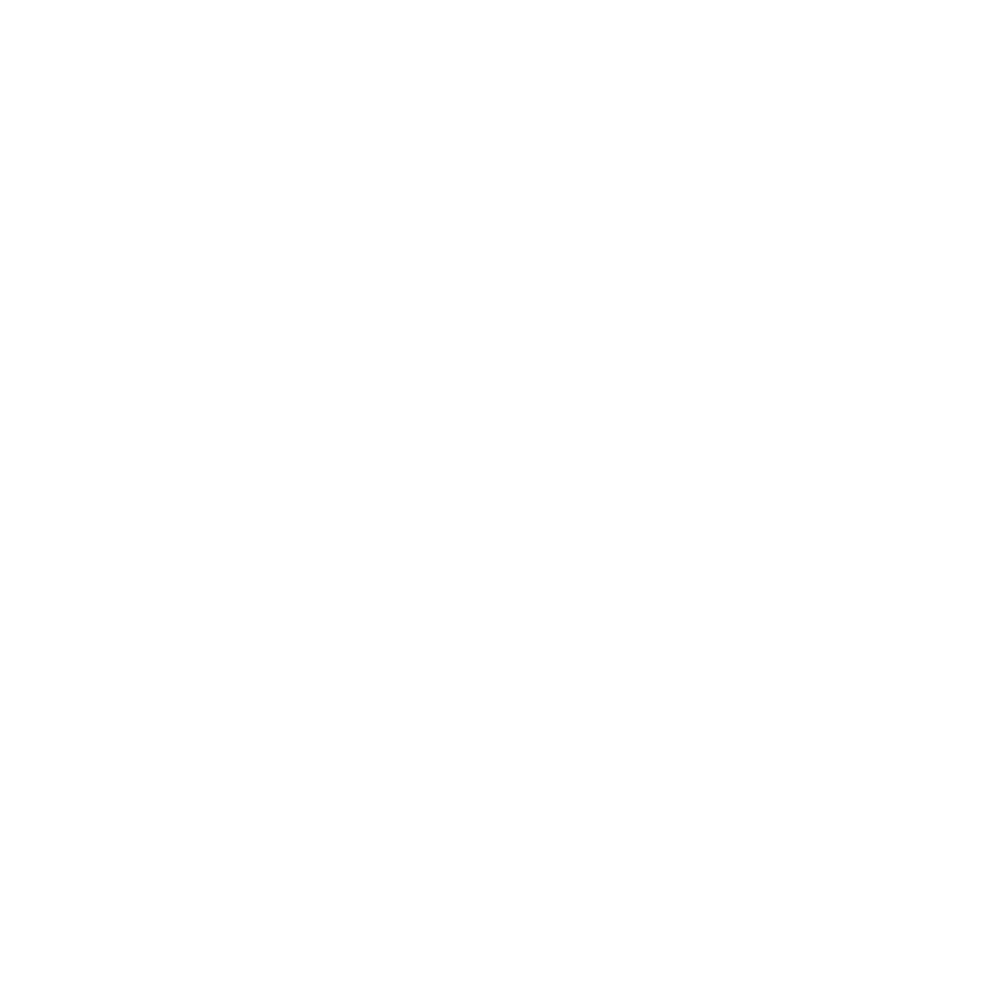
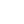
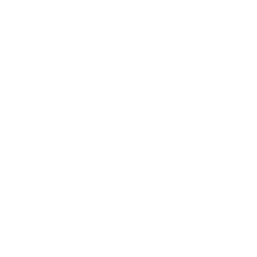

# CMG Application Icons

## play


```typescript
import { CiPlay1 } from "react-icons/...";
<CiPlay1 size={24} />
```

## pause


```typescript
import { CiPause1 } from "react-icons/...";
<CiPause1 size={24} />
```

## stop


```typescript
import { CiStop1 } from "react-icons/...";
<CiStop1 size={24} />
```

## delete


```typescript
import { AiFillDelete } from "react-icons/...";
<AiFillDelete size={24} />
```

## edit


```typescript
import { AiOutlineEdit } from "react-icons/...";
<AiOutlineEdit size={24} />
```

## rename


```typescript
import { CgRename } from "react-icons/...";
<CgRename size={24} />
```

## person


```typescript
import { IoPerson } from "react-icons/...";
<IoPerson size={24} />
```

## person-outline


```typescript
import { IoPersonOutline } from "react-icons/...";
<IoPersonOutline size={24} />
```

## tools


```typescript
import { FaTools } from "react-icons/...";
<FaTools size={24} />
```

## ai-generate


```typescript
import { RiAiGenerate } from "react-icons/...";
<RiAiGenerate size={24} />
```

## arrow-left


```typescript
import { GoArrowLeft } from "react-icons/...";
<GoArrowLeft size={24} />
```

## arrow-right


```typescript
import { GoArrowRight } from "react-icons/...";
<GoArrowRight size={24} />
```

## arrow-up


```typescript
import { GoArrowUp } from "react-icons/...";
<GoArrowUp size={24} />
```

## envelope


```typescript
import { PiEnvelopeThin } from "react-icons/...";
<PiEnvelopeThin size={24} />
```

